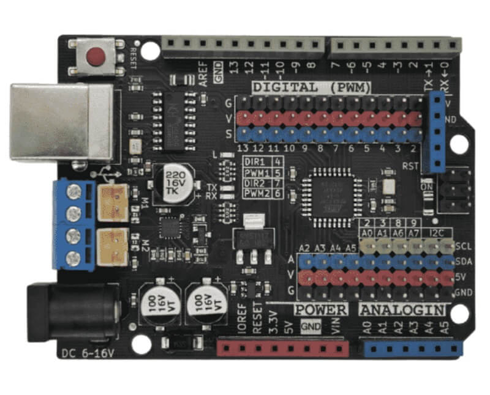
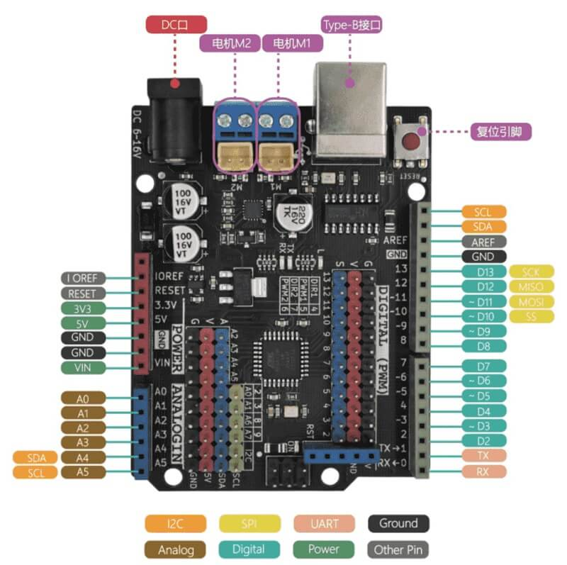
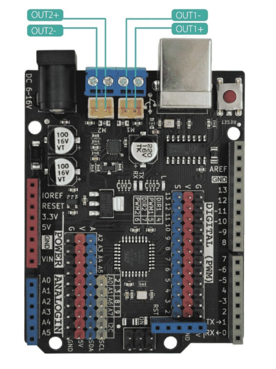
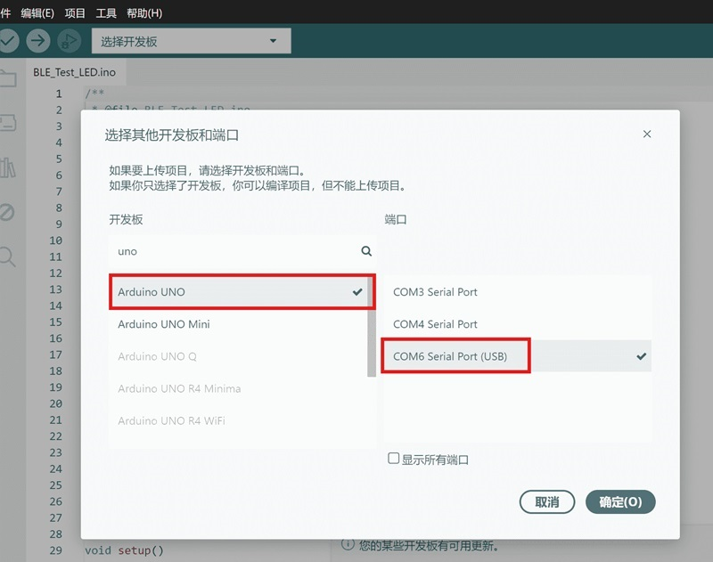
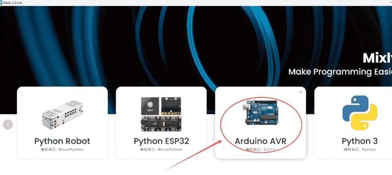
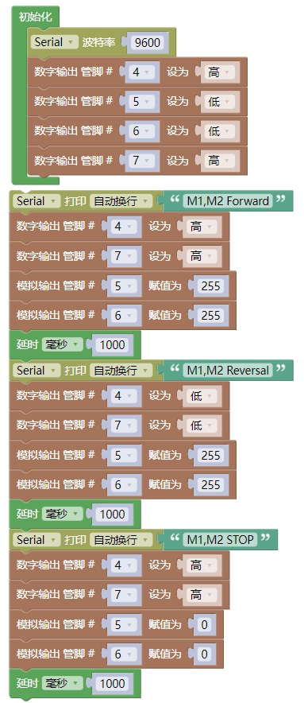
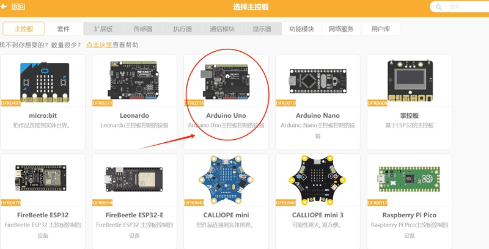
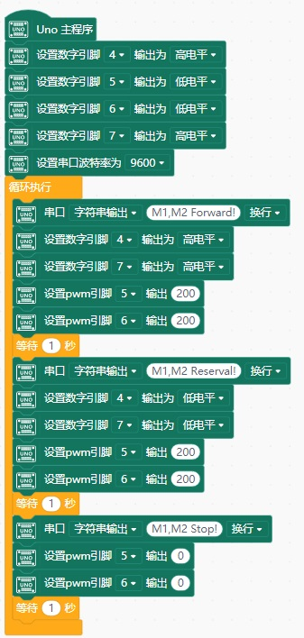

# Maker Uno主板介绍



Maker-Uno是基于Arduino Uno R3基础上开发的一款适用于创客的标志性产品， 功能和引脚完全兼容Arduino Uno R3主板 ,板载2路电机驱动芯片最大驱动电流2A，所有IO口用排针引出，串口芯片为CH340G。

**产品参数**

| 功能          | Arduino Uno R3       | Maker-Uno            |
|:-----------:|:--------------------:|:--------------------:|
| 微控制器        | ATmega328P-PU        | ATmega328P-AU        |
| 串口芯片        | Atmega16u2           | CH340G               |
| 输入电压        | 7-12 V               | 7-16V                |
| 工作电压 (输出电流) | 5V(500mA)            | 5V(1000mA)           |
| 3.3V最大输出电流  | 150mA                | 500mA                |
| 主频          | 外部晶振 16M             | 外部晶振 16M             |
| 输入电压        | 7-12 V               | 7-16V                |
| Flash       | 32K(引导占0.5k)         | 32K(引导占0.5k)         |
| SRAM        | 2K                   | 2K                   |
| ERROM       | 1K                   | 1K                   |
| 电机驱动芯片      | 无                    | TC78H660FTG          |
| IO接口        | 排母                   | 排针+排母                |
| 尺寸/重量       | 68.6 x 53.4 mm / 25g | 68.6 x 53.4 mm / 25g |

**注：** CH340G通过USB Type-B接口连接电脑，串口通信使用D0(RX)和D1(TX)引脚。
## Maker Uno引脚图

以下是您可以在 Maker Uno 板上找到的所有引脚的全局视觉描述。



## 引脚说明

Maker Uno 与官方 Arduino Uno R3完全兼容，所有引脚排列和功能保持一致。与官方 Arduino Uno 不同的是，Maker Uno 将所有 IO 引脚同时用**排针**和**排母**引出，这种双接口设计带来了极大的便利：

### 排针+排母双接口设计优势

| 特性       | 说明                                       |
|:--------:|:---------------------------------------- |
| **兼容性强** | 排母接口完全兼容 Arduino Uno 扩展板（Shield），可直接堆叠使用 |
| **接线便捷** | 排针接口方便使用杜邦线直接连接面包板、传感器、模块                |
| **教学友好** | 排针更适合课堂教学和快速原型搭建，无需焊接                    |
| **扩展灵活** | 同时提供两种接口，满足不同应用场景需求                      |

### 串口扩展接口

与官方 Arduino Uno 不同，Maker Uno 额外引出了 **D0(RX)、D1(TX)、VCC、GND、RST** 五个引脚，采用**蓝色排母接口**，方便连接蓝牙模块、WiFi模块等串口设备。

| 引脚  | 功能   | 说明       |
|:---:|:----:|:--------:|
| D0  | RX   | 串口接收     |
| D1  | TX   | 串口发送     |
| VCC | 5V电源 | 可为外部模块供电 |
| GND | 地线   | 公共地      |
| RST | 复位   | 外部复位信号输入 |

### 传感器接口

Maker Uno 采用**不同颜色排针**设计，方便快速识别和连接传感器模块：

- **V（红色）**：电源正极（5V）
- **G（黑色）**：电源地线（GND）
- **S（蓝色）**：信号引脚

这种醒目的颜色区分设计，有效避免接线错误，特别适合教学和快速原型开发。

### I2C接口

Maker Uno 额外引出了**两组I2C排针**（A4/A5），方便连接I2C设备：
| 引脚      | 功能     | 排针位置 |
|:-------:|:------:|:----:|
| A4(SDA) | I2C数据线 | 模拟区  |
| A5(SCL) | I2C时钟线 | 模拟区  |

两组I2C排针**并联**（电气上是同一组信号），可同时连接多个I2C设备（如OLED显示屏、传感器模块等）。</br>
Maker Uno 共有 **22 个 IO 引脚**，包括：
- **14 个数字引脚**（D0-D13）：支持数字输入/输出，其中 6 个支持 PWM 输出
- **8 个模拟引脚**（A0-A7）：支持模拟输入（10位ADC），其中A0-A5也可作为数字引脚使用，A6-A7仅支持模拟输入

## 数字引脚

Maker Uno 共有 **14 个数字引脚**（D0-D13），工作电压为 5V，可以配置为输入或输出模式。每个引脚都同时引出排针和排母接口。
### 数字引脚功能说明
| 引脚编号 | 引脚名称 | 特殊功能      | PWM输出 | 排针位置 | 备注              |
|:----:|:----:|:---------:|:-----:|:----:|:---------------:|
| D0   | RX   | 串口接收      | -     | 数字区  | 用于接收串口数据        |
| D1   | TX   | 串口发送      | -     | 数字区  | 用于发送串口数据        |
| D2   | INT0 | 外部中断0     | -     | 数字区  | 支持上升沿、下降沿、双边沿触发 |
| D3   | INT1 | 外部中断1     | ✅     | 数字区  | 支持中断，支持PWM输出    |
| D4   | -    | -         | -     | 数字区  | 板载电机DIR1        |
| D5   | -    | Timer0    | ✅     | 数字区  | 板载电机PWM1        |
| D6   | -    | Timer0    | ✅     | 数字区  | 板载电机PWM2        |
| D7   | -    | -         | -     | 数字区  | 板载电机DIR2        |
| D8   | -    | -         | -     | 数字区  | -               |
| D9   | -    | Timer1    | ✅     | 数字区  | 支持PWM输出         |
| D10  | SS   | SPI从机选择   | ✅     | 数字区  | SPI通信时使用        |
| D11  | MOSI | SPI主输出从输入 | ✅     | 数字区  | SPI通信时使用        |
| D12  | MISO | SPI主输入从输出 | -     | 数字区  | SPI通信时使用        |
| D13  | SCK  | SPI时钟     | -     | 数字区  | SPI通信时使用，板载L指示灯 |

## 模拟引脚

Maker Uno 共有 **8 个模拟引脚**（A0-A7），可以读取 0-5V 的模拟电压，转换为 0-1023 的数字值（10位ADC）。

| 引脚    | 功能说明               |
|:-----:|:------------------:|
| A0-A5 | 模拟/数字输入，可作为数字IO使用  |
| A6-A7 | 仅模拟输入，**不可作为数字IO** |

### 模拟引脚功能说明

| 引脚编号 | ADC通道 | I2C功能 | 排针位置 | 备注                 |
|:----:|:-----:|:-----:|:----:|:------------------:|
| A0   | ADC0  | -     | 模拟区  | 模拟/数字输入            |
| A1   | ADC1  | -     | 模拟区  | 模拟/数字输入            |
| A2   | ADC2  | -     | 模拟区  | 模拟/数字输入            |
| A3   | ADC3  | -     | 模拟区  | 模拟/数字输入            |
| A4   | ADC4  | SDA   | 模拟区  | I2C数据线，模拟/数字输入     |
| A5   | ADC5  | SCL   | 模拟区  | I2C时钟线，模拟/数字输入     |
| A6   | ADC6  | -     | 模拟区  | **仅模拟输入，不可作为数字IO** |
| A7   | ADC7  | -     | 模拟区  | **仅模拟输入，不可作为数字IO** |

### 板载资源占用引脚

| 板载资源   | 占用引脚 | 说明             |
|:------:|:----:|:--------------:|
| M1电机方向 | D4   | 控制电机1转向        |
| M1电机速度 | D5   | PWM控制电机1转速     |
| M2电机方向 | D7   | 控制电机2转向        |
| M2电机速度 | D6   | PWM控制电机2转速     |
| L指示灯   | D13  | BootLoader状态指示 |
| RX指示灯  | -    | 串口接收指示         |
| TX指示灯  | -    | 串口发送指示         |

## CH340G驱动安装

驱动安装请参考此文档：[CH340G驱动安装方法](https://docs.emakefun.com/#/zh-cn/driver/ch340_driver/ch340_driver)

## Maker Uno原理图

<a href="zh-cn/arduino_products/uno/maker-uno/Maker_Uno_sch.pdf" target="_blank">原理图点击此处下载</a>

## 电机功能说明

 电机驱动芯片为TC78H660FTG，最大驱动电流为2A。只需要2路PWM和2路普通IO就可以驱动2路电机，减少PWM口占用，不能驱动大功率电机，只能驱动常规的TT电机与积木电机。

> **注意：** 电机驱动需要外部供电，通过板载**DC电源接口**（6-16V）接入电源。仅靠USB供电无法驱动电机。



### M1电机接口

| 控制引脚 | 引脚编号 | 功能说明     |
|:----:|:----:|:--------:|
| DIR1 | D4   | 控制M1电机方向 |
| PWM1 | D5   | 控制M1电机转速 |

| DIR1 | PWM1 | OUT1+ | OUT1- | M1状态 |
|:----:|:----:|:-----:|:-----:|:----:|
| H    | H    | H     | L     | M1正转 |
| L    | H    | L     | H     | M1反转 |
| —    | L    | L     | L     | M1停止 |

### M2电机接口

| 控制引脚 | 引脚编号 | 功能说明     |
|:----:|:----:|:--------:|
| DIR2 | D7   | 控制M2电机方向 |
| PWM2 | D6   | 控制M2电机转速 |

| DIR2 | PWM2 | OUT2+ | OUT2- | M2状态 |
|:----:|:----:|:-----:|:-----:|:----:|
| H    | H    | H     | L     | M2正转 |
| L    | H    | L     | H     | M2反转 |
| —    | L    | L     | L     | M2停止 |

**注：** L :低电平   H：高电平  —：无

**Arduino 电机测试案例**
```c
#define DIR1 4   // 电机1 方向控制引脚（HIGH=正转，LOW=反转）
#define PWM1 5   // 电机1 PWM 调速引脚（0-255）
#define DIR2 7   // 电机2 方向控制引脚
#define PWM2 6   // 电机2 PWM 调速引脚

void setup() {
  Serial.begin(9600);              // 初始化串口，波特率9600

  pinMode(DIR1, OUTPUT);           // 设置电机1方向引脚为输出
  pinMode(PWM1, OUTPUT);           // 设置电机1 PWM引脚为输出
  pinMode(DIR2, OUTPUT);           // 设置电机2方向引脚为输出
  pinMode(PWM2, OUTPUT);           // 设置电机2 PWM引脚为输出
}

void loop() {
  // ---- 正转 ----
  Serial.println("M1,M2 Forward");
  digitalWrite(DIR1, HIGH);        // 电机1 正转
  analogWrite(PWM1, 255);          // 电机1 全速（255 = 100%占空比）
  digitalWrite(DIR2, HIGH);        // 电机2 正转
  analogWrite(PWM2, 255);          // 电机2 全速
  delay(1000);                     // 保持1秒

  // ---- 反转 ----
  Serial.println("M1,M2 Reversal");
  digitalWrite(DIR1, LOW);         // 电机1 反转
  analogWrite(PWM1, 255);          // 电机1 全速
  digitalWrite(DIR2, LOW);         // 电机2 反转
  analogWrite(PWM2, 255);          // 电机2 全速
  delay(1000);                     // 保持1秒

  // ---- 停止 ----
  Serial.println("M1,M2 Stop");
  analogWrite(PWM1, 0);            // 电机1 停转（占空比=0）
  analogWrite(PWM2, 0);            // 电机2 停转
  delay(1000);                     // 保持1秒
}
```

在Arduino IDE平台选择板卡Arduino UNO以及正确的端口。[点击查看ArduinoIDE2.0详细介绍](https://docs.emakefun.com/#/zh-cn/software/arduino_ide/arduino_ide.zh-CN)



**Mixly 电机测试案例**</br>
在Mixly 2.0平台选择板卡Arduino AVR。[点击查看Mixly2.0基础使用教程](https://docs.emakefun.com/#/zh-cn/software/mixly/mixly)</br>
</br>
选择主板及端口后即可将代码上传至主板</br>
</br>
参考代码</br>


**Mind+电机测试案例**</br>
在“拓展”中选择主板。[点击查看Mind+使用介绍](https://docs.emakefun.com/#/zh-cn/software/mind_plus/mindplus.zh-CN)</br>
</br>
</br>
选择对应的端口后即可将代码上传至主板</br>
</br>
参考代码</br>


## 指示灯说明

- ON标识的红色等为电源指示灯，供电后会常亮
- L 标识的黄色灯为BootLoader识别指示灯，当通过USB连接电脑后，端口识别到板子的时候该LED灯会快速闪烁。也可以作为板载LED使用，当引脚输出高电平时打开LED，当引脚输出低电平时关闭LED。
- RX 标识的LED灯为串口接收指示灯，当串口接收到数据，LED灯会闪烁。
- TX 标识的LED灯为串口发送指示灯，当串口发送数据时，LED灯会闪烁。

## FAQ

1. 板子能驱动那些电机？</br>
   答：支持驱动TT塑料电机与积木电机，支持12V 2A内的电机，不支持大功率电机。
2. 为什么电机不动？</br>
答：请先检查是否接上外接了6~16V以内的DC头电源，如果没有接外接电源请接上外接电源。若外接电源接上了，请检查程序是否上传成功。
3. 如何确认bootloader是否掉了？</br>
答：按下复位键后，L指示灯连续闪烁3三次表示bootloader没有掉，如果按下复位键L指示灯没有闪烁那就表明bootloader掉了，需要重新烧录bootloader。
4. 如何确定板子损坏？</br>
a、先确定板子上的ON灯是否亮起，如果供电正确，ON不亮代表，主板有地方短路，可能芯片或者电源烧了</br>
b、检查bootloard是否正常，如不正常请重新上传或者返厂维修。
