# AI-VOX3 开发板

## 概述

AI-VOX3是一款专为AI语音交互应用设计的高性能嵌入式开发板。 其核心采用ESP32-S3-R8芯片，并板载16MB Flash存储器 。集成了麦克风和功放喇叭、SD卡、电源管理等硬件资源，支持快速开发与灵活扩展。支持本地语音唤醒、指令识别和语音合成，可广泛应用于智能家居、教育设备和物联网终端等领域。同时配套AI-VOX3扩展板与MD40电机驱动板，助力开发者基于板载资源快速构建语音AI产品原型。

**核心特性：**

- ESP32-S3主控，双核 Xtensa LX7 处理器，240MHz 主频
- 16MB Flash + 8MB PSRAM
- Wi-Fi + Bluetooth 5 (BLE)
- 板载ES8311音频编解码器 + 3W功放
- 支持LCD/OLED 显示扩展
- Type-C供电支持锂电池充电

**配套扩展：**

- AI-VOX3扩展板：扩展更多功能接口
- MD40 电机驱动板：驱动4个电机

---

## 产品图

| 正面 | 反面 |
|------|------|
| 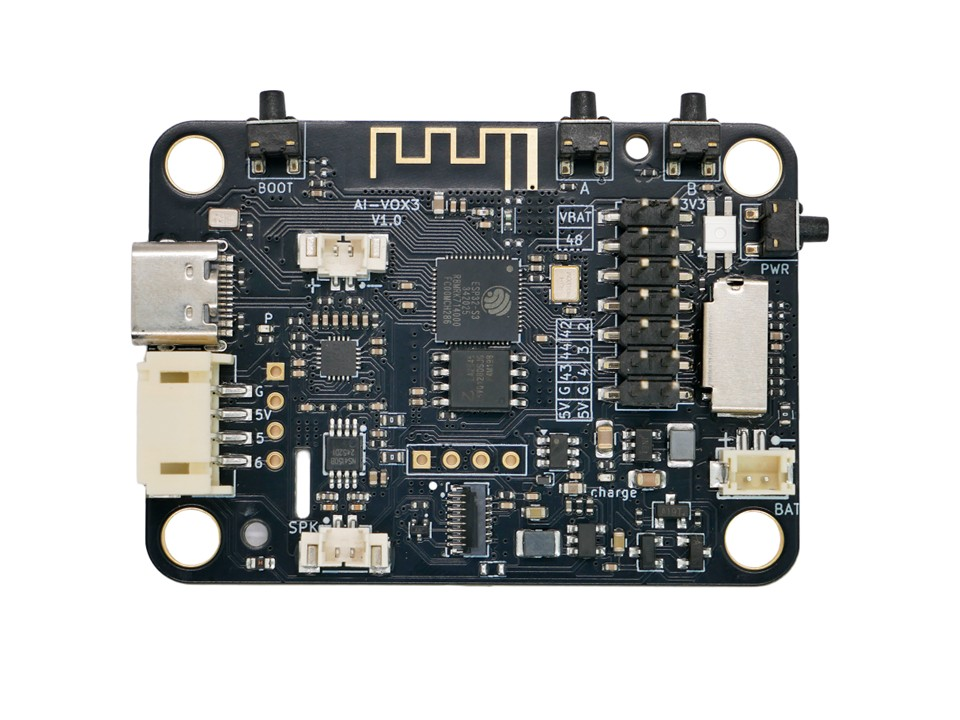 | 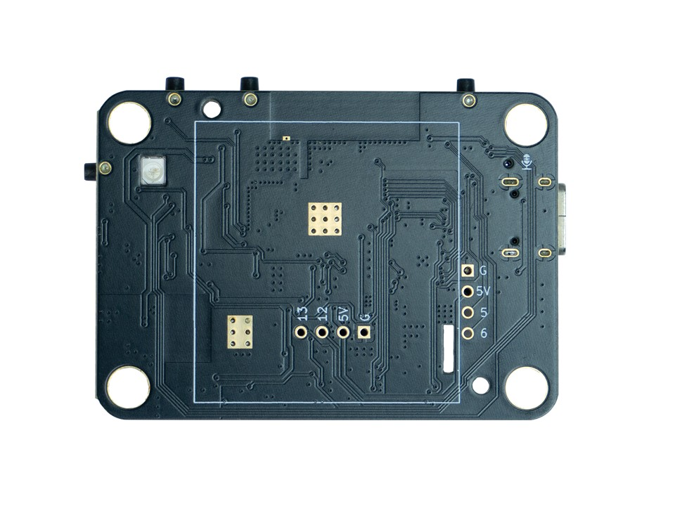 |

### 功能标注

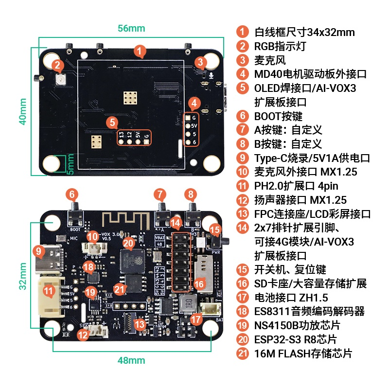

---

## 硬件说明

### 最小系统

<div style="display: flex; gap: 0; align-items: center; border: 1px solid #ddd; border-radius: 4px; overflow: hidden;">
    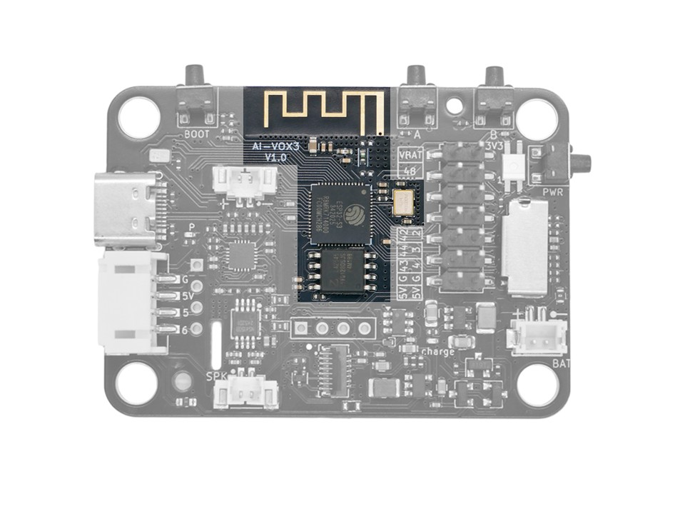
    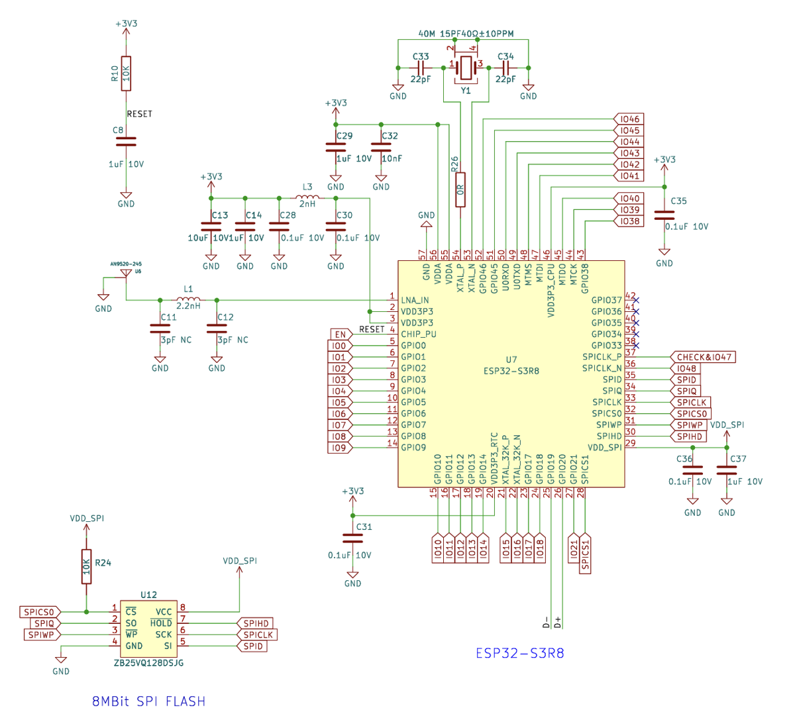
</div>

#### 主控芯片

- **型号：** ESP32-S3-R8
- **架构：** Xtensa LX7 双核处理器
- **主频：** 高达 240MHz
- **内置存储：** 512KB SRAM + 384KB ROM
- **无线：** Wi-Fi 802.11 b/g/n + Bluetooth 5 (BLE)
- **数据手册：**<a href="https://documentation.espressif.com/esp32-s3_datasheet_cn.pdf" target="_blank">ESP32-S3规格书</a> | <a href="https://documentation.espressif.com/esp32-s3_technical_reference_manual_cn.pdf" target="_blank">ESP32-S3应用参考手册</a>

#### Flash 存储

- **容量：** 16MB
- **接口：** SPI
- **用途：** 存储固件和用户数据

#### PSRAM

- **容量：** 8MB（芯片内置）
- **用途：** 大数据量缓存、音频处理、图像缓冲

---

### 显示接口

#### TFT-LCD 显示屏（SPI）

<div style="display: flex; gap: 0; align-items: center; border: 1px solid #ddd; border-radius: 4px; overflow: hidden;">
    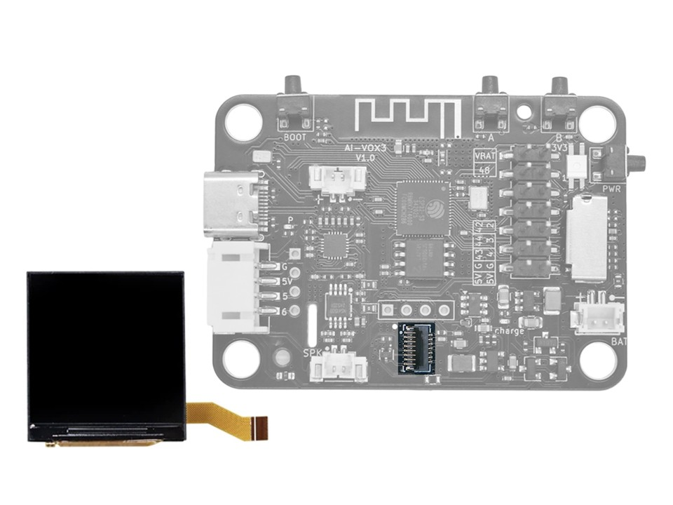
    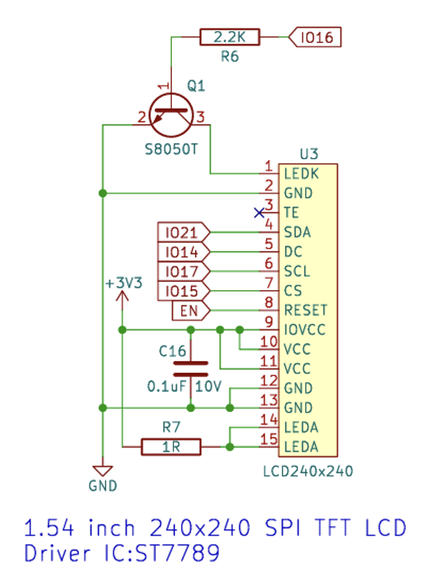
</div>

支持1.54寸240×240 SPI  LCD（ST7789 驱动），通过 14pin FPC 排线连接。
复位：随主控同步复位。

| 功能 | 引脚 | 说明 |
|------|------|------|
| SDA | IO21 | SPI 数据 |
| SCL | IO17 | SPI 时钟 |
| DC | IO14 | 数据/命令选择 |
| CS | IO15 | 片选 |
| 背光 | IO16 | 背光控制（PWM） |

**数据手册：** <a href="zh-cn/esp32/ai-vox3/docs/ST7789V.pdf" target="_blank">ST7789V LCD 驱动芯片</a>

##### 示例程序：LCD 显示屏测试

测试 LCD 显示屏，程序运行后依次显示文字和彩色方块，验证屏幕是否正常工作。

- **依赖库：** [GFX Library for Arduino](https://github.com/moononournation/Arduino_GFX)（Arduino 库管理器搜索安装）
- **下载：** [ai_vox3_lcd.zip](./ai-vox3_arduino_test_demo/ai_vox3_lcd.zip)

<details open>
<summary>关键代码</summary>

```cpp
#include <Arduino_GFX_Library.h>

#define GFX_BL 16

Arduino_DataBus *bus = new Arduino_ESP32SPI(
  14 /*DC*/, 15 /*CS*/, 17 /*SCK*/, 21 /*MOSI*/,
  GFX_NOT_DEFINED /*MISO*/, FSPI
);
Arduino_GFX *gfx = new Arduino_ST7789(
  bus, -1 /*RST*/, 0 /*rotation*/, true /*IPS*/, 240, 240, 0, 0
);

void setup() {
  Serial.begin(115200);
  gfx->begin();
  gfx->fillScreen(RGB565_BLACK);

  pinMode(GFX_BL, OUTPUT);
  digitalWrite(GFX_BL, HIGH);

  // 显示红色文字
  gfx->setCursor(10, 10);
  gfx->setTextColor(RGB565_RED);
  gfx->println("Hello World!");
  delay(5000);

  // 绘制彩色方块
  gfx->fillRect(50, 50, 30, 20, RGB565_GREEN);
  delay(5000);
  gfx->fillRect(100, 100, 30, 20, RGB565(255, 0, 0));
  gfx->fillRect(150, 150, 30, 20, RGB565(0, 255, 0));
  gfx->fillRect(200, 200, 30, 20, RGB565(0, 0, 255));
}

void loop() {
  delay(1000);
}
```

</details>

#### OLED 显示屏（I2C）

<div style="display: flex; gap: 0; align-items: center; border: 1px solid #ddd; border-radius: 4px; overflow: hidden;">
    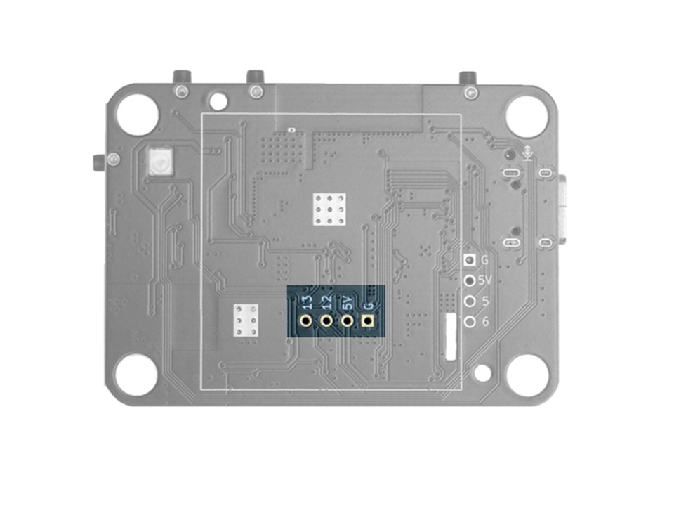
    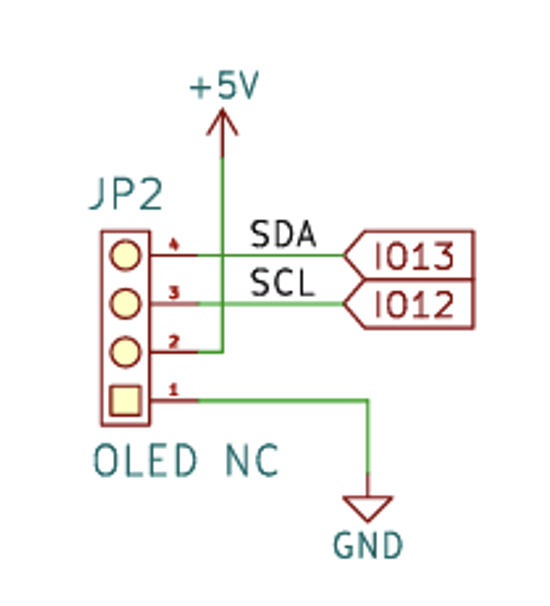
</div>

预留 4pin OLED 插口，共用 I2C 总线。

| 功能 | 引脚 | 说明 |
|------|------|------|
| SCL | IO12 | 共用I2C总线 |
| SDA | IO13 | 共用I2C总线 |

**选择建议：**
- TFT-LCD：彩色显示，适合图形界面
- OLED：低功耗，适合简单文本/图标
- **注意：** OLED 和 LCD只能二选一使用

---

### 音频系统

<div style="display: flex; gap: 0; align-items: center; border: 1px solid #ddd; border-radius: 4px; overflow: hidden;">
    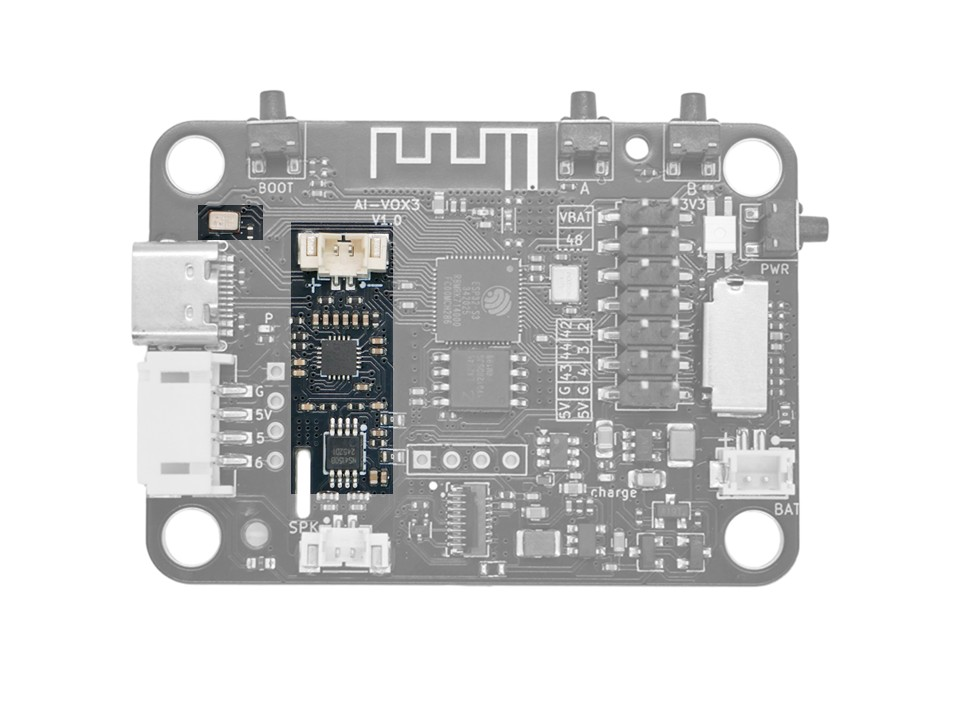
    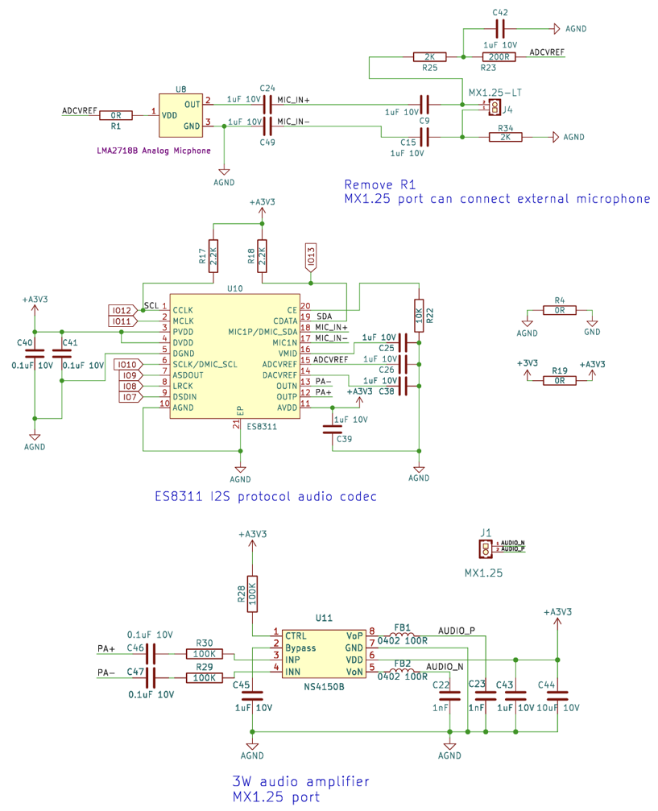
</div>

#### 音频编解码器

- **型号：** ES8311
- **接口：** I2C（配置）+ I2S（数据传输）
- **功能：** 集成 ADC（模拟麦克风输入）和 DAC（喇叭输出）
- **采样率：** 8kHz ~ 96kHz
- **位深：** 16/24 bit
- **数据手册：** <a href="zh-cn/esp32/ai-vox3/docs/ES8311.PDF" target="_blank">ES8311 音频编解码器</a>

#### ES8311 引脚定义

| 功能 | 引脚 | 说明 |
|------|------|------|
| I2C SCL | IO12 | I2C 时钟线 |
| I2C SDA | IO13 | I2C 数据线 |
| I2S MCLK | IO11 | 主时钟 |
| I2S SCLK | IO10 | 位时钟 |
| I2S LRCK | IO9 | 左右声道时钟 |
| I2S ASDOUT | IO8 | DAC 输出（到功放） |
| I2S DSDIN | IO7 | ADC 输入（从麦克风） |

#### 功放

- **型号：** NS4150B
- **输出功率：** 3W（4Ω 负载）
- **输入：** ES8311 PAOUTP/PAOUTN（差分输出）
- **特点：** 低失真、高效率
- **数据手册：** <a href="zh-cn/esp32/ai-vox3/docs/NS4150B.pdf" target="_blank">NS4150B D类功放</a>

#### 麦克风

- **板载：** 模拟麦克风
- **外接：** MX1.25 接口（2pin），使用时需将R1电阻去除以断开板载麦克风（实测不断开好像也都能用）
- **信号路径：** 麦克风 → ES8311 MIC_IN+/- → ADC → I2S
- **特性：** 支持单麦打断功能

#### 示例程序：麦克风功放回环测试

实现麦克风输入 → 功放输出的实时回环。对着板载麦克风说话，声音从外接喇叭实时播放。

- **依赖库：** 无（使用 ESP-IDF 底层 I2S 驱动）
- **下载：** [es8311_test.zip](./ai-vox3_arduino_test_demo/es8311_test.zip)

<details open>
<summary>关键代码</summary>

```cpp
#include <driver/i2s_std.h>
#include "es8311.h"

i2s_chan_handle_t g_rx_handle = nullptr;
i2s_chan_handle_t g_tx_handle = nullptr;

void setup() {
  // 初始化 I2S 通道（16kHz, 16bit, 单声道）
  i2s_chan_config_t chan_cfg = I2S_CHANNEL_DEFAULT_CONFIG(I2S_NUM_1, I2S_ROLE_MASTER);
  i2s_new_channel(&chan_cfg, &g_tx_handle, &g_rx_handle);

  i2s_std_config_t std_cfg = {
    .clk_cfg  = I2S_STD_CLK_DEFAULT_CONFIG(16000),
    .slot_cfg = I2S_STD_PHILIPS_SLOT_DEFAULT_CONFIG(
                  I2S_DATA_BIT_WIDTH_16BIT, I2S_SLOT_MODE_MONO),
    .gpio_cfg = {
      .mclk = 11, .bclk = 10, .ws = 8,
      .dout = 7,  .din  = 9,
    },
  };
  std_cfg.slot_cfg.slot_mask = I2S_STD_SLOT_LEFT;
  i2s_channel_init_std_mode(g_tx_handle, &std_cfg);
  i2s_channel_init_std_mode(g_rx_handle, &std_cfg);
  i2s_channel_enable(g_tx_handle);
  i2s_channel_enable(g_rx_handle);

  // 初始化 ES8311（I2C: SCL=IO12, SDA=IO13）
  i2c_master_bus_config_t i2c_cfg = {
    .i2c_port = I2C_NUM_1,
    .sda_io_num = 13, .scl_io_num = 12,
  };
  i2c_master_bus_handle_t i2c_bus;
  i2c_new_master_bus(&i2c_cfg, &i2c_bus);
  es8311_handle_t es = es8311_create(i2c_bus, ES8311_ADDRRES_0);
  es8311_init(es, &clk_cfg, ES8311_RESOLUTION_16, ES8311_RESOLUTION_16);
  es8311_voice_volume_set(es, 70, nullptr);
  es8311_microphone_config(es, false);
  es8311_microphone_gain_set(es, ES8311_MIC_GAIN_12DB);
}

void loop() {
  // 麦克风 → 喇叭 实时回环
  int16_t buffer[16000 / 1000 * 20];
  i2s_channel_read(g_rx_handle, buffer, sizeof(buffer), nullptr, UINT32_MAX);
  i2s_channel_write(g_tx_handle, buffer, sizeof(buffer), nullptr, UINT32_MAX);
}
```

</details>

---

### 存储扩展

#### SD 卡接口

<div style="display: flex; gap: 0; align-items: center; border: 1px solid #ddd; border-radius: 4px; overflow: hidden;">
    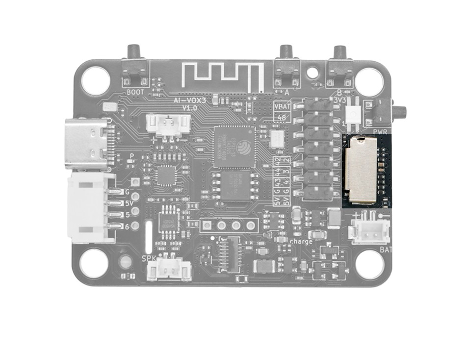
    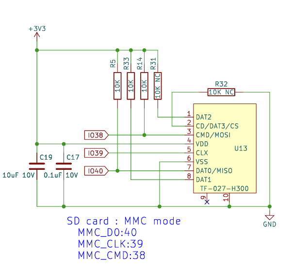
</div>

- **卡槽型号：** TF-027-H300
- **支持卡型：** microSD（TF 卡）
- **接口模式：** SD_MMC 1-bit
- **文件系统：** FAT32
- **建议最大容量：** 32GB

#### SD 卡引脚定义

| 功能 | 引脚 | 说明 |
|------|------|------|
| CMD | IO38 | 命令/数据 |
| CLK | IO39 | 时钟 |
| DAT0 | IO40 | 数据 |

**用途：** 存储音频文件、日志数据、配置文件等。

#### 示例程序：SD 卡 MP3 播放

从 SD 卡读取 MP3 文件并通过 ES8311 播放。需要在 SD 卡根目录放置 `test.mp3` 文件。

- **依赖库：** [ESP32-audioI2S](https://github.com/schreibfaul1/ESP32-audioI2S)（Arduino 库管理器搜索安装）
- **下载：** [esp8311_sdmmc_test.zip](./ai-vox3_arduino_test_demo/esp8311_sdmmc_test.zip)

<details open>
<summary>关键代码</summary>

```cpp
#include "Audio.h"
#include "es8311.h"

Audio audio;
ES8311 es;

void setup() {
  Serial.begin(115200);

  // 初始化 SD 卡（SD_MMC 1-bit 模式）
  SD_MMC.setPins(39 /*CLK*/, 38 /*CMD*/, 40 /*D0*/);
  if (!SD_MMC.begin("/sdcard", true)) {
    Serial.println("Card Mount Failed");
  }

  // 初始化 I2S 功放使能
  pinMode(53, OUTPUT);
  digitalWrite(53, HIGH);
  audio.setPinout(10 /*BCLK*/, 8 /*LRC*/, 7 /*DOUT*/, 11 /*MCLK*/);
  audio.setVolume(21);

  // 初始化 ES8311
  es.begin(13 /*SDA*/, 12 /*SCL*/, 400000);
  es.setVolume(80);
  es.setBitsPerSample(16);

  // 播放 SD 卡中的 /test.mp3
  audio.connecttoFS(SD_MMC, "/test.mp3");
}

void loop() {
  audio.loop();
  vTaskDelay(1);
}
```

</details>

---

### 扩展接口

<div style="display: flex; gap: 0; align-items: center; border: 1px solid #ddd; border-radius: 4px; overflow: hidden;">
    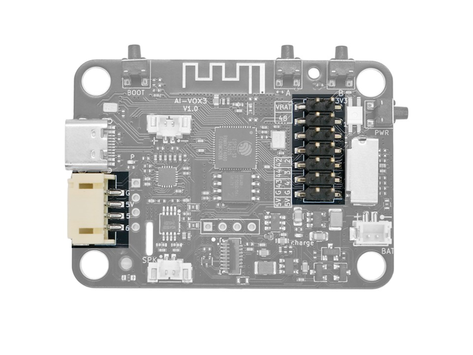
    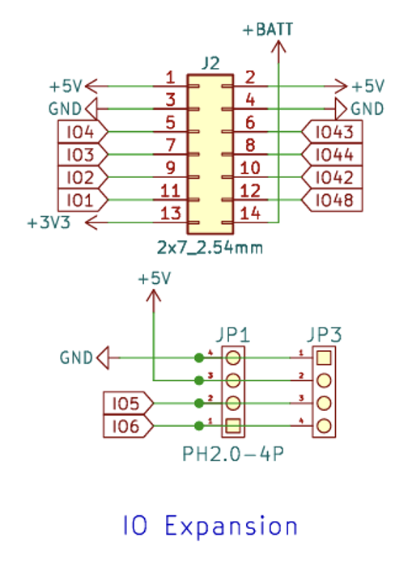
</div>

#### GPIO 排针（8-pin）

| 引脚 | 功能 | 说明 |
|------|------|------|
| IO1 | GPIO | 通用输入输出 |
| IO2 | GPIO | 通用输入输出 |
| IO3 | GPIO | 通用输入输出 |
| IO4 | GPIO | 通用输入输出 |
| IO42 | GPIO | 通用输入输出 |
| IO43 | GPIO | 通用输入输出 |
| IO44 | GPIO | 通用输入输出 |
| IO48 | GPIO | 通用输入输出 |

**注意：** 所有 GPIO 均支持 PWM、中断、I2C、SPI 等复用功能。

#### PH2.0 接口（4-pin）

| 引脚 | 功能 | 说明 |
|------|------|------|
| IO5 | GPIO | 通用输入输出 |
| IO6 | GPIO | 通用输入输出 |
| +5V | 电源 | 5V 供电输出/输入 |
| GND | 地 | 公共地 |

**用途：** 可与其他主控板通讯，或作为 5V 电源输出。

#### 配套扩展板

- **AI-VOX3 扩展板：** 通过排针接口扩展更多功能
- **MD40 电机驱动板：** 驱动直流电机、编码电机、舵机

---

## 电源管理

<div style="display: flex; gap: 0; align-items: center; border: 1px solid #ddd; border-radius: 4px; overflow: hidden;">
    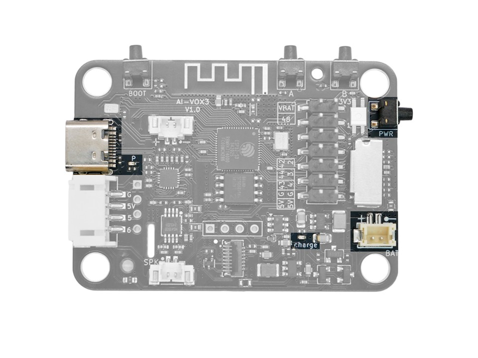
    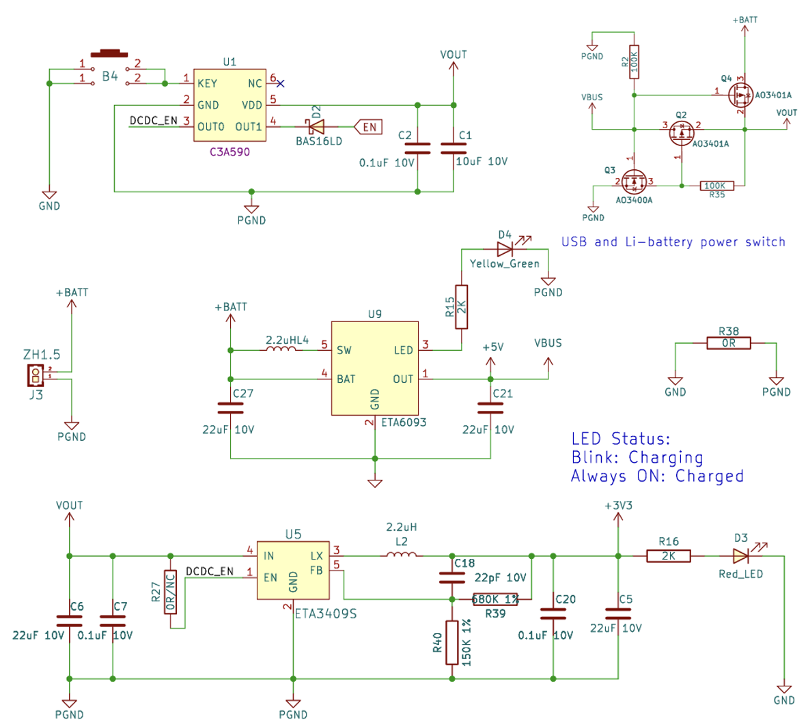
</div>

### 供电方式

#### Type-C接口

- **电压：** 5V
- **电流：** 最高 1.2A
- **功能：** 供电 + 下载程序 + 锂电池充电

#### 锂电池接口

- **电压：** 3.7V ~ 4.2V
- **接口：** ZH1.5-2pin
- **充电管理：** 板载 ETA6093 充电芯片
- **充电效率：** 95%

**注意：** 任何供电方式都需要短按 PWR 按键开机。

### 充电参数

- **充电芯片：** ETA6093（充电升压一体）
- **转换效率：** 95%
- **输入：** USB Type-C 5V，最高 1.2A
- **电量检测：** IO18 ADC 实时检测电池电压
- **数据手册：** <a href="zh-cn/esp32/ai-vox3/docs/ETA6093.pdf" target="_blank">ETA6093 充电管理芯片</a>

### PWR 按键

| 操作 | 状态 | 功能 |
|------|------|------|
| 短按 | 关机状态 | 开机，红色 PWR 灯亮起 |
| 短按 | 开机状态 | 系统复位 |
| 长按 | 开机状态 | 关机，红色 PWR 灯熄灭 |

### 电源指示灯

| LED | 颜色 | 状态 | 说明 |
|-----|------|------|------|
| PWR | 红色 | 常亮 | 电源开启 |
| PWR | 红色 | 熄灭 | 电源关闭 |

### 充电指示灯

| LED | 颜色 | 状态 | 说明 |
|-----|------|------|------|
| CHARGE | 黄绿色 | 闪烁 | 充电中 |
| CHARGE | 黄绿色 | 常亮 | 电池已充满 |

---

## 按键

<div style="display: flex; gap: 0; align-items: center; border: 1px solid #ddd; border-radius: 4px; overflow: hidden;">
    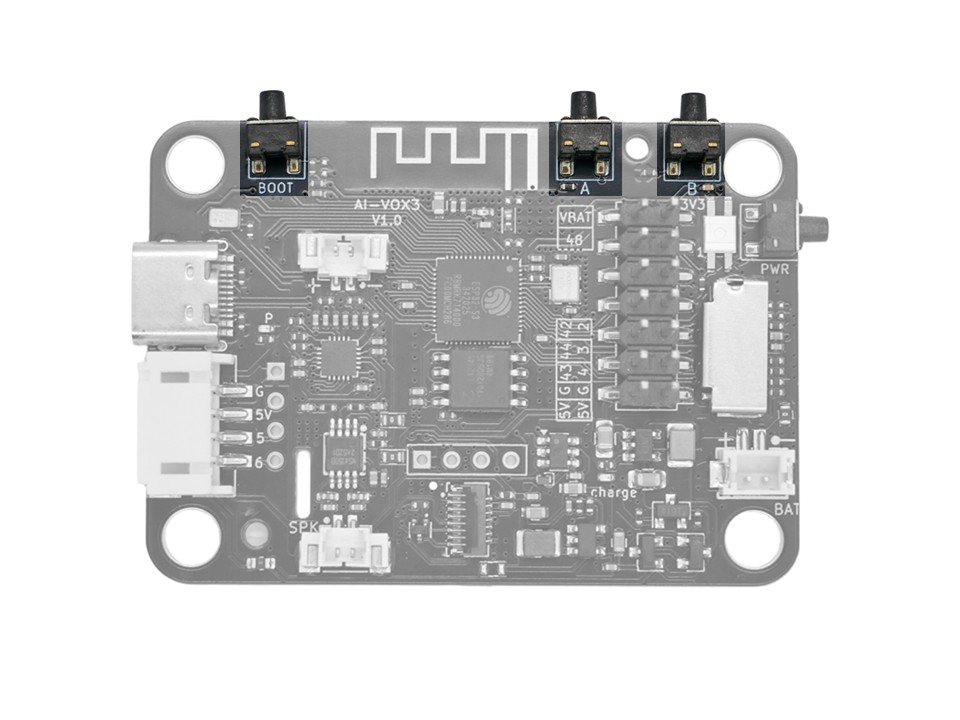
    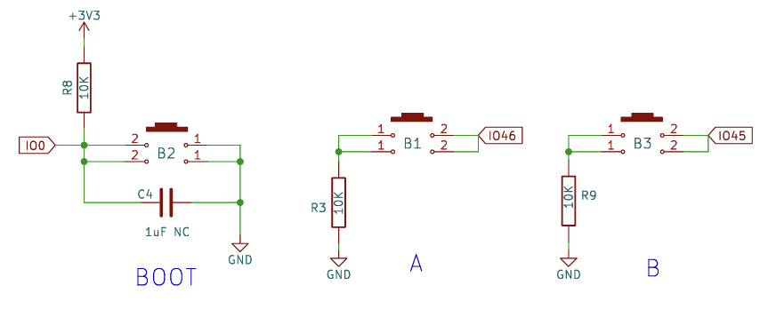
</div>

### 用户按键

| 按键 | 引脚 | 功能 |
|------|------|------|
| 按键 A | IO46 | 可编程用户按键 |
| 按键 B | IO45 | 可编程用户按键 |
| BOOT | IO0 | 启动模式选择（按住 BOOT + 短按 PWR 进入下载模式） |

#### 示例程序：按键测试

检测用户的按下操作，结果通过串口输出。

- **依赖库：** 无
- **下载：** [button_test.zip](./ai-vox3_arduino_test_demo/button_test.zip)

<details open>
<summary>关键代码</summary>

```cpp
#define BUTTONA_PIN 46
#define BUTTONB_PIN 45
#define KEY_DELAY 20

void setup() {
  Serial.begin(115200);
  delay(10);
  pinMode(BUTTONA_PIN,INPUT);
  pinMode(BUTTONA_PIN,INPUT);
  Serial.println("Button Test Start");
}

void loop() {
  if (digitalRead(BUTTONA_PIN) == LOW)
  {
    delay(KEY_DELAY);       
    if (digitalRead(BUTTONA_PIN) == LOW)
    {
      Serial.println("按下按键A");
      while(digitalRead(BUTTONA_PIN) == LOW);
      delay(KEY_DELAY);
    }
  }

  if (digitalRead(BUTTONB_PIN) == LOW)
  {
    delay(KEY_DELAY);
    if (digitalRead(BUTTONB_PIN) == LOW)
    {
      Serial.println("按下按键B");
      while(digitalRead(BUTTONB_PIN) == LOW);
      delay(KEY_DELAY);
    }
  }
}
```

</details>

---

## LED 指示灯

### RGB LED

| LED | 引脚 | 说明 |
|-----|------|------|
| WS2812B | IO41 | 可编程 RGB LED，支持 24-bit 真彩色 |

**数据手册：** <a href="zh-cn/esp32/ai-vox3/docs/WS2812B.pdf" target="_blank">WS2812B RGB LED</a>

#### 示例程序：RGB LED 测试

控制 WS2812B 依次显示红、绿、蓝、白四色，然后执行呼吸灯效果。

- **依赖库：** [Adafruit NeoPixel](https://github.com/adafruit/Adafruit_NeoPixel)（Arduino 库管理器搜索安装）
- **下载：** [ws2812b_test.zip](./ai-vox3_arduino_test_demo/ws2812b_test.zip)

<details open>
<summary>关键代码</summary>

```cpp
#include <Adafruit_NeoPixel.h>

Adafruit_NeoPixel strip(1, 41, NEO_GRB + NEO_KHZ800);

void setup() {
  Serial.begin(115200);
  strip.begin();
  strip.setBrightness(50);
  strip.show();

  // 上电闪烁 3 次白光
  for (int i = 0; i < 3; i++) {
    strip.setPixelColor(0, strip.Color(255, 255, 255));
    strip.show(); delay(200);
    strip.clear();
    strip.show(); delay(200);
  }
}

void loop() {
  // 颜色测试：红 → 绿 → 蓝 → 白
  uint32_t colors[] = {
    strip.Color(255, 0, 0),   strip.Color(0, 255, 0),
    strip.Color(0, 0, 255),   strip.Color(255, 255, 255)
  };
  for (int i = 0; i < 4; i++) {
    strip.setPixelColor(0, colors[i]);
    strip.show(); delay(1000);
  }
  strip.clear(); strip.show(); delay(500);

  // 呼吸灯效果（3 轮）
  for (int round = 0; round < 3; round++) {
    for (int b = 0; b <= 255; b += 5) {
      strip.setBrightness(b);
      strip.setPixelColor(0, strip.Color(255, 255, 255));
      strip.show(); delay(15);
    }
    for (int b = 255; b >= 0; b -= 5) {
      strip.setBrightness(b);
      strip.setPixelColor(0, strip.Color(255, 255, 255));
      strip.show(); delay(15);
    }
  }
}
```

</details>

---

## 开发指南

### Arduino IDE

#### 环境配置

参考：[ESP32 系列上传程序方法](../esp32_software_instructions/esp32_software_instructions.md)

**开发板选择：**

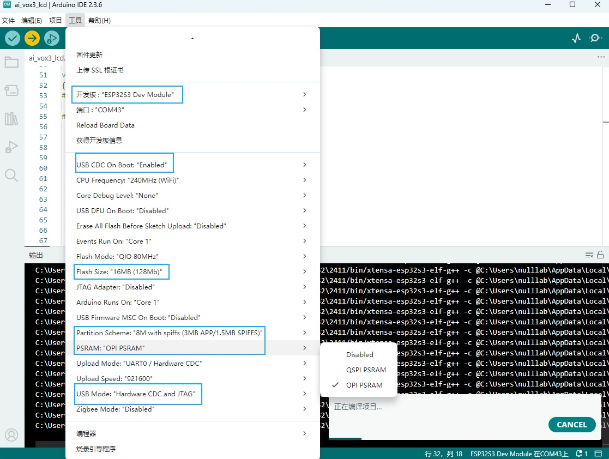

**推荐配置：**

| 选项 | 值 |
|------|-----|
| Board | ESP32S3 Dev Module |
| Flash Size | 16MB |
| PSRAM | OPI PSRAM |
| Upload Speed | 921600 |
| USB CDC On Boot | Enable |

---

## 故障排除

### 无法开机

**问题：** 按下 PWR 按键后无反应，PWR 灯不亮。

**解决方案：**

1. 检查供电：确认Type-C或锂电池已连接
2. 检查电池电压：锂电池电压应 > 3.5V
3. 长按 PWR 按键 3 秒强制开机
4. 尝试更换 Type-C 线缆或充电器

---

### 无法下载程序

**问题：** Arduino IDE 提示 "Failed to connect to ESP32-S3"。

**解决方案：**

1. 按住 BOOT 按键，再短按 PWR 按键进入下载模式
2. 检查 USB 线缆是否支持数据传输（非纯充电线）
3. 安装 [Zadig](https://zadig.akeo.ie/) 驱动（Windows）
4. 降低 Upload Speed 到 115200

---

### 音频无输出

**问题：** 播放音频时喇叭无声。

**解决方案：**

1. 检查喇叭连接：确认喇叭已连接到 PH2.0-2pin 接口
2. 检查音量：确认 ES8311 音量未静音
3. 运行 `es8311_test` 示例验证硬件
4. 检查 I2S 引脚配置：IO7-IO11 是否正确

---

### SD 卡无法识别

**问题：** `SD.begin()` 返回 false。

**解决方案：**

1. 检查 SD 卡格式：必须为 FAT32（不支持 exFAT）
2. 超过 32GB 的卡需要用第三方工具格式化为 FAT32
3. 重新插拔 SD 卡
4. 运行 `esp8311_sdmmc_test` 示例验证

---

### Wi-Fi 连接不稳定

**问题：** Wi-Fi 信号弱或频繁断开。

**解决方案：**

1. 检查天线：确认板载天线未被遮挡
2. 远离干扰源：避开 2.4GHz 设备（微波炉、蓝牙等）
3. 调整 Wi-Fi 信道：使用 1、6、11 信道
4. 降低 Wi-Fi 功率：`WiFi.setTxPower(WIFI_POWER_8_5dBm)`

---

## 资源下载

### 原理图

<a href="zh-cn/esp32/ai-vox3/docs/AI-VOX3-Schematic.pdf" target="_blank">点击查看原理图</a>

### 芯片数据手册

- <a href="https://documentation.espressif.com/esp32-s3_datasheet_cn.pdf" target="_blank">ESP32-S3规格书</a>
- <a href="https://documentation.espressif.com/esp32-s3_technical_reference_manual_cn.pdf" target="_blank">ESP32-S3应用参考手册</a>
- <a href="zh-cn/esp32/ai-vox3/docs/ES8311.PDF" target="_blank">ES8311音频编解码器</a>
- <a href="zh-cn/esp32/ai-vox3/docs/NS4150B.pdf" target="_blank">NS4150B D类功放</a>
- <a href="zh-cn/esp32/ai-vox3/docs/ETA6093.pdf" target="_blank">ETA6093 充电管理芯片</a>
- <a href="zh-cn/esp32/ai-vox3/docs/ST7789V.pdf" target="_blank">ST7789V LCD 驱动芯片</a>
- <a href="zh-cn/esp32/ai-vox3/docs/WS2812B.pdf" target="_blank">WS2812B RGB LED</a>

### 3D模型

<a href="zh-cn/esp32/ai-vox3/ai-vox3_3d.zip" download>点击下载3d模型文件</a>

### 下载全部资料

<a href="zh-cn/esp32/ai-vox3/ai-vox3_resource.zip" download>点击下载全部资料压缩包</a>

---

## 应用案例

### 小智AI

AI-VOX3可用于制作小智AI语音助手，支持语音对话、音乐播放、智能家居控制等功能。

https://dcnmu33qx4vc.feishu.cn/docx/VXHzdBYH0ohpNAxw2ifc3P2InBe

### CodexPad-S10手柄控制

使用CodexPad-S10手柄控制AI-VOX3控制MD40来驱动，直流电机、编码电机、舵机等外设。

[查看详细教程](https://gitee.com/nulllab_1/docs_examples_gamepad_peripheral_control/blob/main/examples_description_ai_vox3_base.zh-CN.md)

---

## 版本历史

| 版本 | 日期 | 修改内容 |
|------|------|---------|
| V1.0 | 2026-06-25 | 初始版本 |
| V1.1 | 2026-7-10 | 增加分模块详细介绍 |

---
