# 金手指IO扩展板

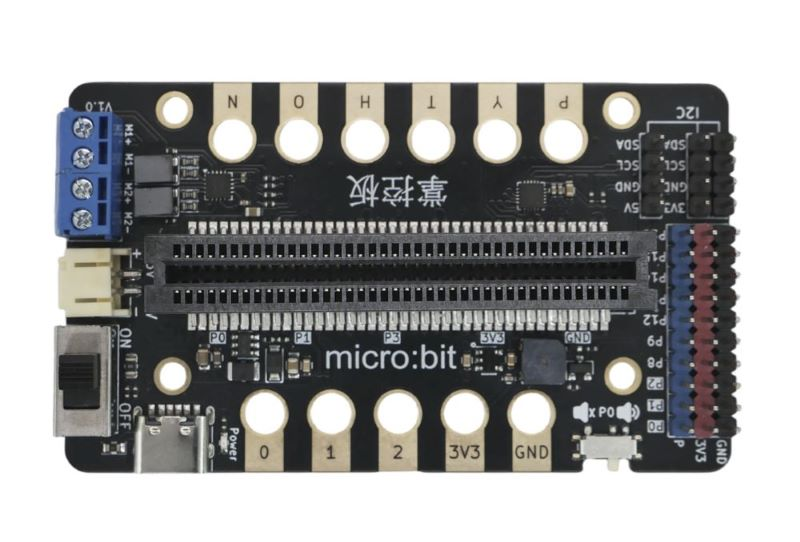

## 简介

金手指 IO 扩展板是一款兼容micro:bit、iot:bit 和掌控板、行空板等金手指插槽主板的多功能扩展板。 扩展板引出 10 路数字/模拟 3Pin 口、3 路 I2C 接口，板载两路 I2C 电机驱动（无需占用额外引脚），提供 PH2.0 和 Type-C 两种供电方式，板载高品质无源蜂鸣器（带独立开关），并引出 9 个鳄鱼夹接口（兼容掌控板触控金手指和 micro:bit 金手指）。扩展板兼容乐高尺寸孔位，可与乐高积木拼插结合。

## 技术规格

### 电源参数

- PH2.0 供电：3 节 5 号干电池（3.5V~5V）或 3.7V 锂电池
- Type-C 供电：USB 接口外接供电（3.5V~5V）
- 主板供电：掌控板/micro:bit/iot:bit 直接供电（驱动能力有限）

### 接口参数

- 3Pin PH2.0 接口：10 路，数字/模拟 IO 口（P0/P1/P2/P8/P9/P12/P13/P14/P15/P16）
- I2C 接口：3 路，两路 3.3V 供电，一路 5V 供电
- 电机接口：2 路，M1/M2 螺丝接线端子
- 触摸金手指：6 个，P/Y/T/H/O/N（兼容掌控板触控）
- IO 金手指：5 个，0/1/2/3V3/GND
- 鳄鱼夹接口：9 个，兼容掌控板触控金手指和 micro:bit 金手指

### 机械参数

- 尺寸：80mm × 47mm，PCB 厚度：1.6mm
- 金手指孔径：4.8mm、孔距：8mm
- 背面：平整设计，可平铺到木板等表面

## 原理图

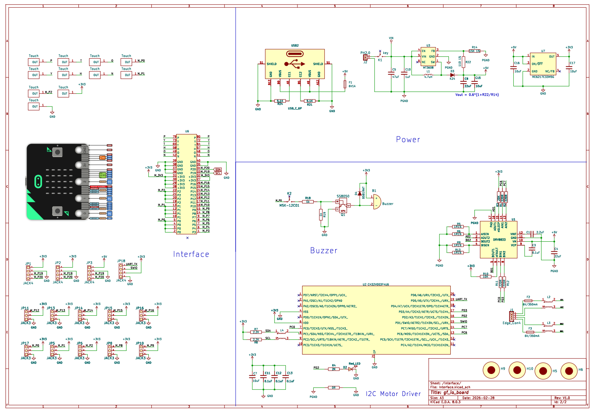

<a href="zh-cn/microbit/gf_io_board/gf_io_schematic.pdf" target="_blank">点击查看原理图</a>

## 尺寸图

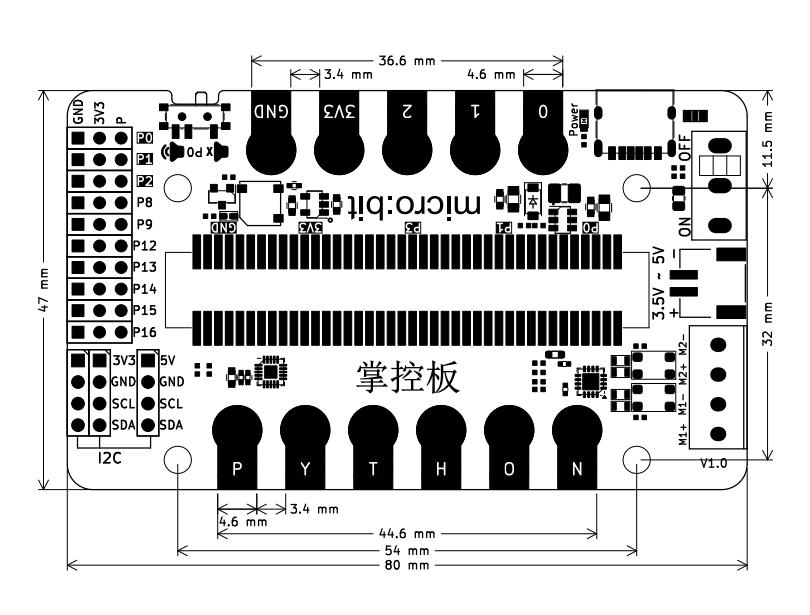

<a href="zh-cn/microbit/gf_io_board/gf_io_dxf.pdf" target="_blank">点击查看尺寸标注图</a>

## 硬件接口介绍

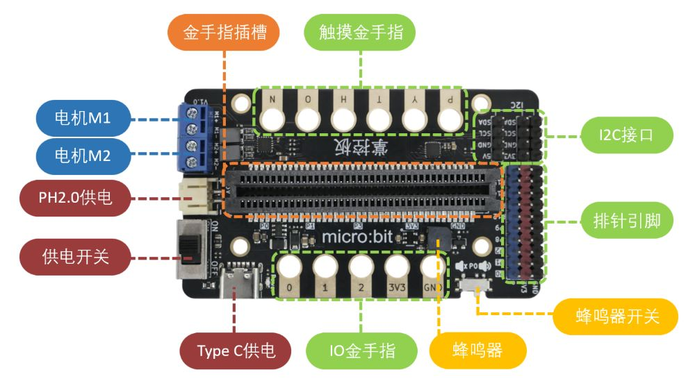

### 电源部分

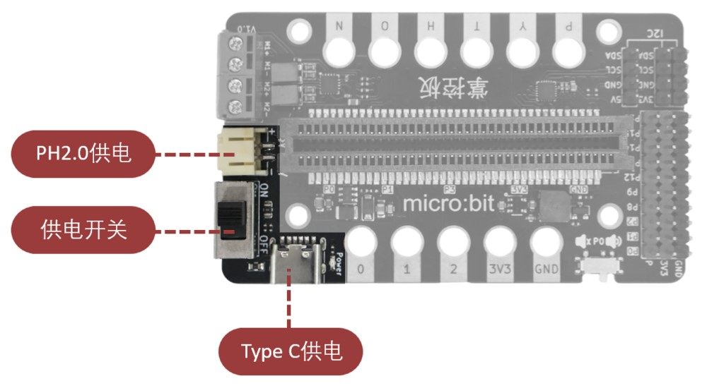

金手指 IO 扩展板提供三种供电方式：

| 供电方式 | 接口类型 | 电压范围 | 说明 |
|---------|---------|---------|------|
| Type-C 供电 | USB Type-C | 3.5~5V | 使用电脑 USB 口、充电宝或手机充电头供电，所有功能均可使用 |
| PH2.0 供电 | PH2.0 2-pin | 3.5~5V | 使用3节5号干电池盒或 3.7V 锂电池，所有功能均可使用 |
| 主板供电 | 金手指插槽 | - | 使用主板 USB 或电源口供电，因主板驱动电流有限，**无法使用电机驱动** |

- **拨动开关**：板载 ON/OFF 拨动开关，控制 PH2.0 外接供电电源通断
- **电源指示**：接通电源后电源指示灯点亮

> **注意**：
> - 使用掌控板供电时，因 IO 口驱动能力有限，无法驱动大功率外设（如电机），请使用外接电池或 USB 口供电
> - 多种供电方式请勿同时使用，以免造成损坏

### 电机部分

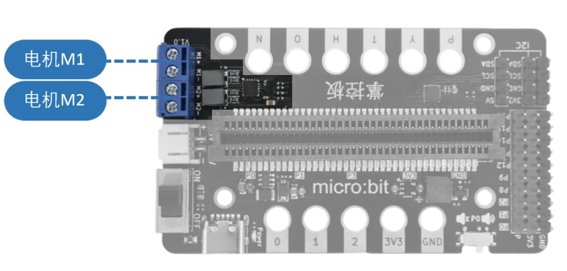

金手指 IO 扩展板集成两路电机驱动，可独立控制两个电机：
- 接口类型：蓝色螺丝接线端子（M1+/M1-/M2+/M2-）

#### 电机驱动参数

板载电机驱动通过 I2C 协议（地址 0x15）接收指令输出 4 路 PWM 波，驱动两路电机。

- 适用电机类型：小型马达、TT 马达、N20 电机、积木马达等
- 单路最大驱动电流：350mA
- 最高驱动电压：5V
- 控制方式：I2C 通信，无需占用额外 IO 引脚

> **注意**：使用电机功能时，必须使用 Type-C 或 PH2.0 外接供电，主板供电无法驱动电机。

### 接口部分

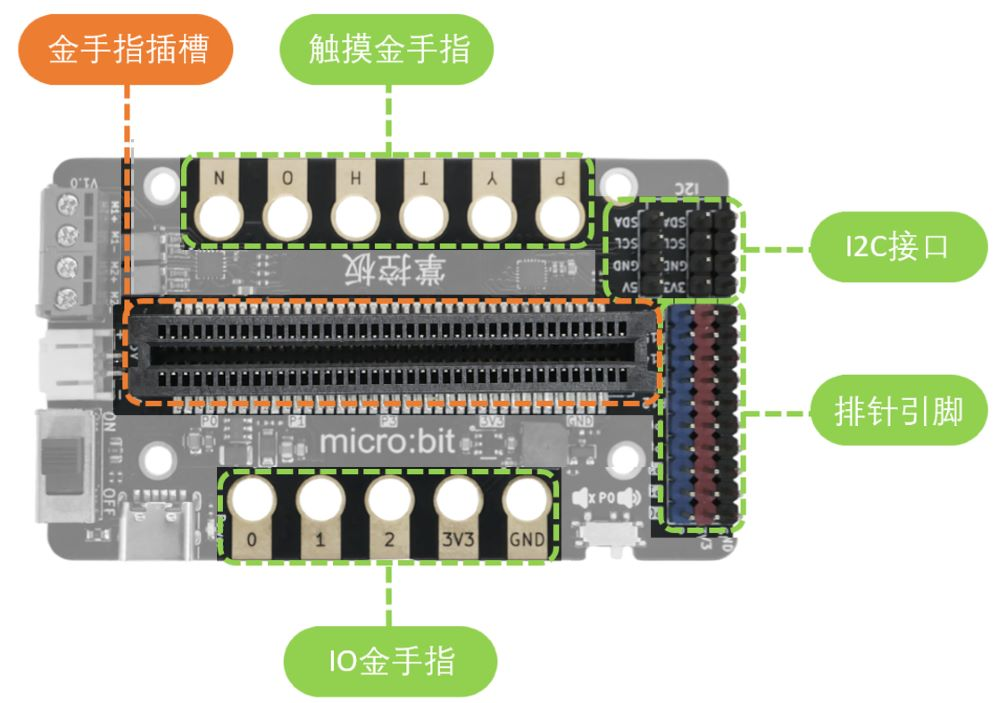

#### 金手指插槽

板载双排金手指插槽，兼容三种主板：

- **正面插入 micro:bit/iot:bit**：灯珠一面面向"micro:bit"文字标识
- **反面插入掌控板**：屏幕一面面向"掌控板"文字标识

#### 排针引脚

扩展板引出10组IO口，每个组包含信号引脚、3.3V 和 GND：

| 信号引脚 | 类型 | 说明 |
|------|------|------|
| P0 | 模拟/数字 | 蜂鸣器默认连接此引脚（可通过开关断开） |
| P1 | 模拟/数字 | - |
| P2 | 模拟/数字 | - |
| P8 | 数字 | - |
| P9 | 数字 | - |
| P12 | 数字 | **掌控板、IO:BIT 不支持此引脚** |
| P13 | 数字 | - |
| P14 | 数字 | - |
| P15 | 数字 | - |
| P16 | 数字 | - |

#### I2C 接口（3 路）

板载 3 路 I2C 专用 PH2.0 4-pin 接口，包含 VCC、SCL、SDA、GND 引脚，其中两路VCC为3.3V、一路为5V，方便连接 I2C 通信模块（如 LCD1602 液晶显示屏、传感器等）。

#### 触摸金手指（P、Y、T、H O、N）

板载 5 个触摸金手指，标注为 P/Y/T/H/O/N，兼容掌控板的触控金手指功能。可通过鳄鱼夹线连接，实现触摸检测、人体感应等交互功能。

#### IO 金手指（0、1、2、3V3、GND）

板载 5 个 IO 金手指，分别为 0/1/2/3V3/GND，兼容 micro:bit 的金手指接口，可通过鳄鱼夹线快速连接外部模块。

### 蜂鸣器

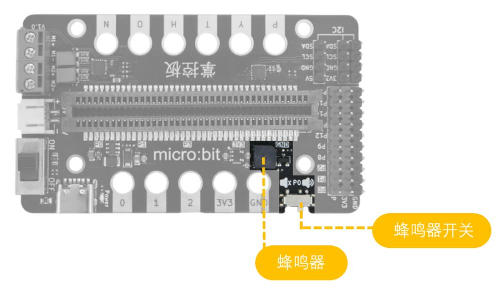

- 类型：高品质无源蜂鸣器
- 连接引脚：P0（micro:bit 模式下）
- 独立开关：板载蜂鸣器开关，可随时关闭蜂鸣器

> **注意**：使用掌控板时，请关闭蜂鸣器开关，避免占用 P0 口。

## 使用方法

### 主板安装方向

- **掌控板**：屏幕一面面向"掌控板"文字标识（正面插入）
- **micro:bit / iot:bit**：灯珠一面面向"micro:bit"文字标识（反面插入）

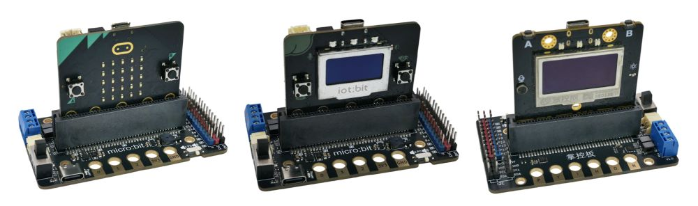

### 供电方式选择

| 使用场景 | 推荐供电方式 | 说明 |
|---------|-------------|------|
| 仅使用传感器/IO 口 | 主板 USB 供电 | 简单方便，但无法驱动电机 |
| 使用电机/大功率外设 | Type-C 或 PH2.0 供电 | 提供足够驱动电流 |
| 移动/便携项目 | PH2.0 电池供电 | 使用电池盒或锂电池，配合拨动开关控制 |

## 使用例程

### Mind+ 上传模式使用掌控板驱动电机

1. 下载及安装 Mind+ 软件
   
   下载地址：https://www.mindplus.cc
   
   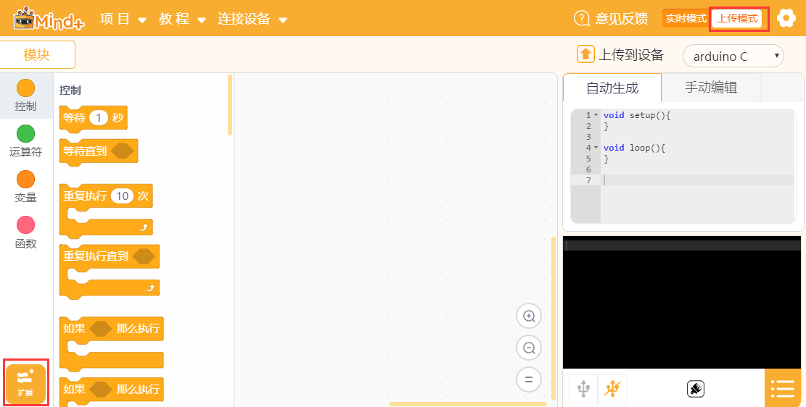

2. 切换到"上传模式"

3. 在"扩展"中先选择"主控板"中的"掌控板"，再打开"模块扩展"选择"扩展板"

    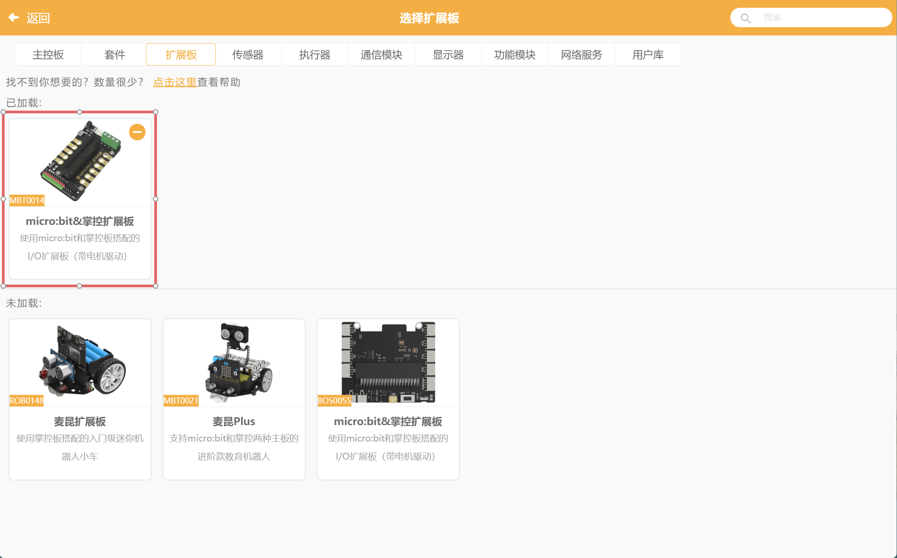

4. 菜单"连接设备"→"上传到设备"

#### 示例程序

运行以下程序结果：两个电机转速分别为 200 转和 100 转，正转 2 秒，反转 2 秒，停止 2 秒，一直循环。

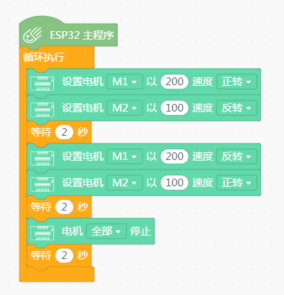
