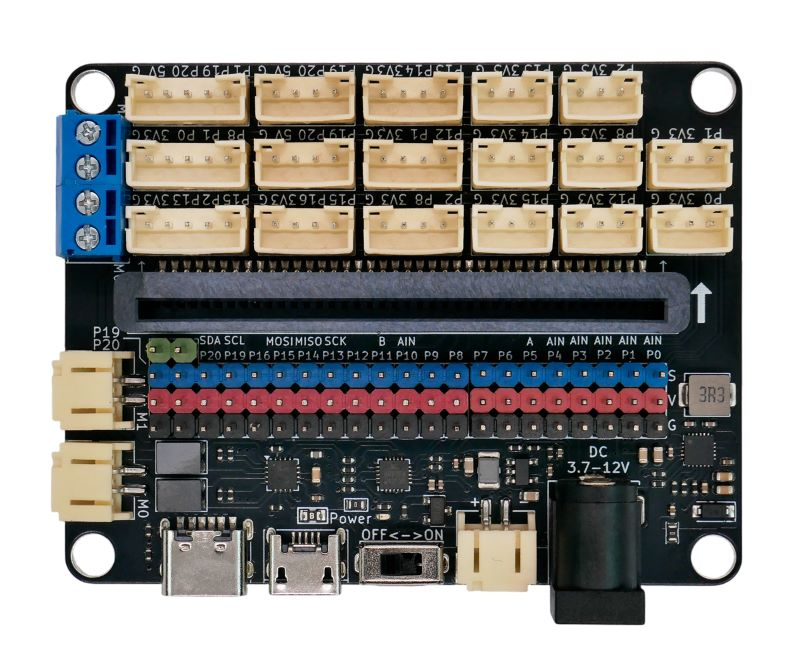
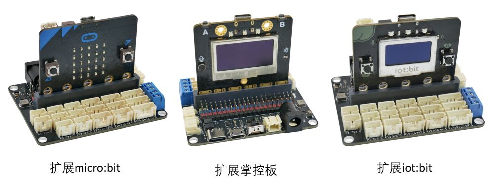
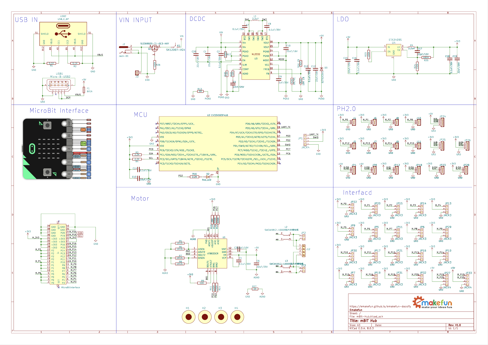
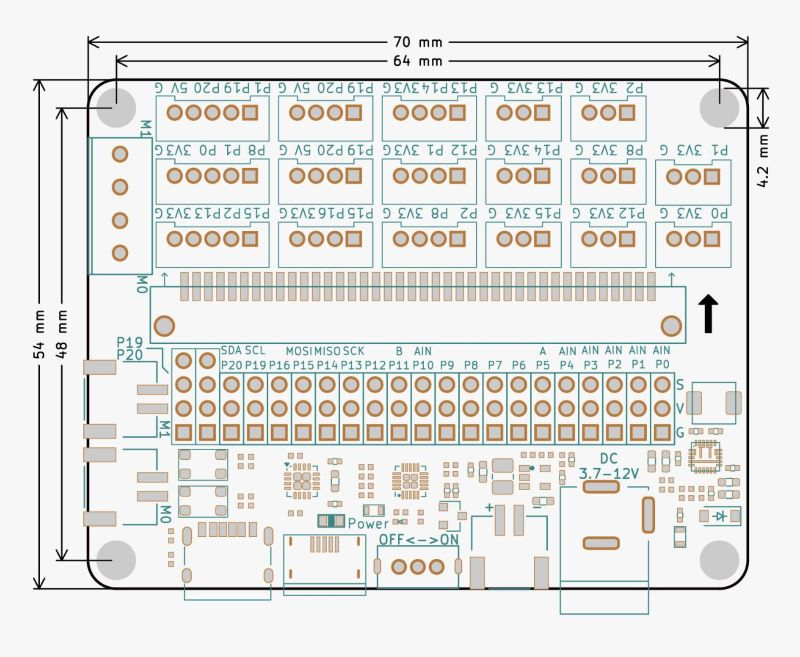
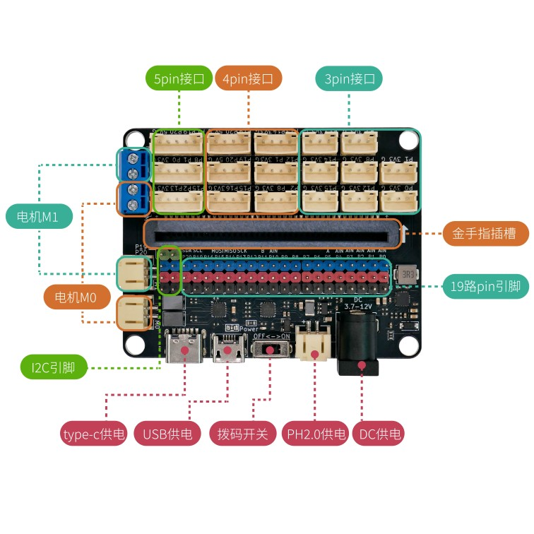
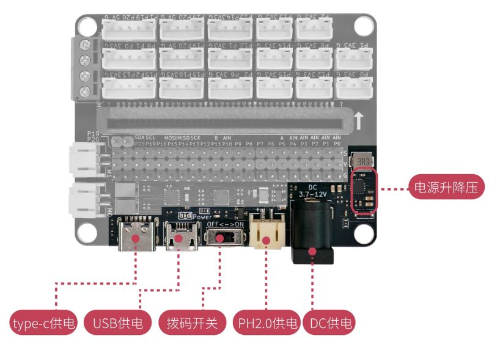
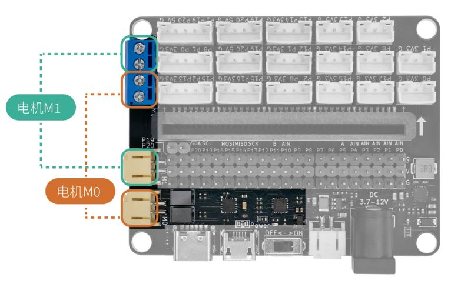

# mBit-Hub扩展板

## 简介

mBit-Hub是一款为兼容micro:bit金手指主板，打造的一款集IO引脚引出、PH2.0接口、两路电机驱一体的多功能扩展板。一块扩展板即可满足传感器接入、电机控制、外部供电等多种需求，让兼容micro:bit 的主板开发更加简洁高效。 
mBit-Hub将micro:bit金手指19路Pin引脚通过PH2.0接口和排针引出，板载两路I2C协议电机驱动（M0/M1，不占用主板IO口），板载强大升降压电源模块。提供 Type-C、Micro-USB、PH2.0、DC 头四种供电方式，适用于机器人、智能小车、创客项目等多种场景。

## 兼容多种主板

也兼容**行空板**

## mBit-Hub 参数介绍

- 产品尺寸：70mm × 54mm，PCB板厚度：1.6mm
- 安装孔距：64mm × 48mm，安装孔直径：4.2mm
- DC头（5.5-2.1mm）/PH2.0接口输入电压：3.7~12V
- USB 输入电压：5V
- 电机驱动电压：5V
- 电机驱动电流：单路最大1A
- 电机控制方式：I2C 通信（地址 0x15）

## 原理图

<a href="zh-cn/microbit/mBit-Hub/mBit-Hub_schematic.pdf" target="_blank">点击查看原理图</a>

## 机械尺寸图

<a href="zh-cn/microbit/mBit-Hub/mBit-Hub.zip" download>下载mBit-Hub 3D文件</a>

## 硬件接口介绍

### 电源部分

mBit-Hub 提供四种供电方式，板载电源升降压电路，可根据输入电压自动调节输出。

| 供电方式 | 接口类型 | 电压范围 |
|---------|---------|---------|
| Type-C 供电 | USB Type-C，Micro-USB | 5V |
| PH2.0 供电 | PH2.0 2pin | 3.7~12V |
| DC 供电 | DC 5.5-2.1mm | 3.7~12V |

- **拨码开关**：板载 ON/OFF 拨码开关，控制DC电源通断，不影响USB供电
- **电源指示灯**：接通电源后红色电源指示灯点亮

> **注意**：多种供电方式请勿同时使用，以免造成损坏。

### 电机部分

mBit-Hub集成两路电机驱动，可通过I2C独立控制电机 M0 与 M1，不占用IO口 。

#### 电机驱动参数

mBit-Hub 的电机驱动通过 I2C 协议（地址 0x15）接收指令输出 4 路 PWM 波，驱动两路电机。

- 适用电机类型：小型马达、微型水泵、TT 马达、N20 电机、积木马达等
- 单路最大驱动电流：峰值1000mA，稳定输出500mA
- 驱动电压：稳压5V，电机速度不受电池电压而变化。

[点击查看电机驱动详情](../../ph2.0_sensors/actuators/dm11/dm11.md)

### 接口部分

#### 金手指插槽

板载金手指插槽，可将 micro:bit 主板插入即可使用。插槽位于板子中央，插入时注意方向标识（箭头方向）。

#### PH2.0 接口

mBit-Hub 提供多种规格的 PH2.0 接口，将 micro:bit 的 PIN 引脚引出：

| 接口类型 | 数量 | 说明 | 对应引脚 |
|---------|------|------|------|
| 5pin 接口 | 3个 |  三引脚组合引出 |(P15,P2,P13)、(P8,P1,P0)、(P1,P19,P20)|
| 4pin 接口 | 6个 |  双引脚引出，含两个 I2C 接口 |(P2,P8)、(P12,P1)、(P13,P14)、(P15,P16)、(P19,P20)x2|
| 3pin 接口 | 8个 |  单引脚引出 |P0、P1、P2、P8、P12、P13、P14、P15|

> 注意：涉及I2C引脚 (P19、P20) 的接口供电为5V，其余则为3.3V

#### 19路 pin 引脚

板载彩色排针（蓝色=IO引脚、红色=3.3V、黑色=GND），标注 P0~P20 全部引脚，可通过杜邦线灵活连接外部模块。

#### I2C 引脚

板载两路 I2C 专用引脚，包含 5V、SCL(P19)、SDA(P20)、GND 四个引脚，方便连接 I2C 通信模块。
