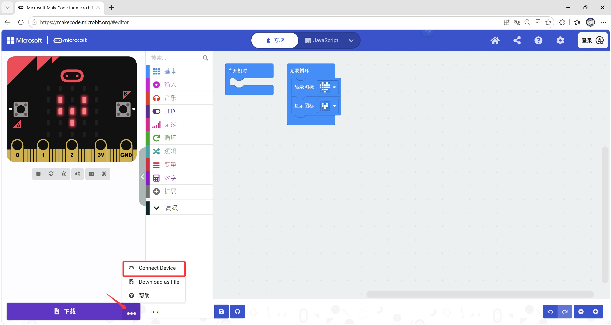
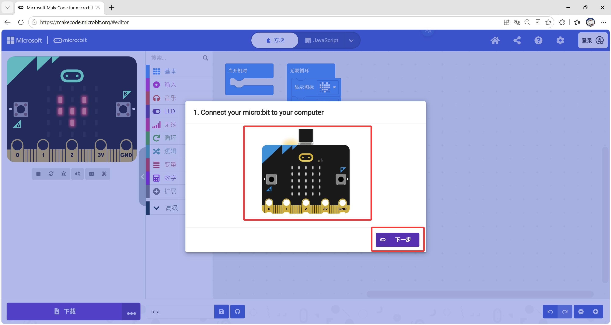
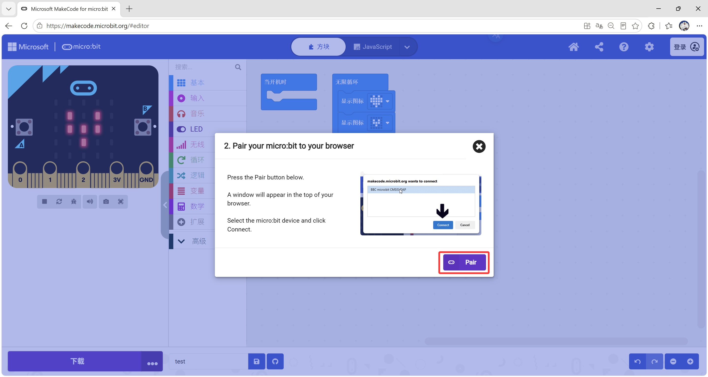
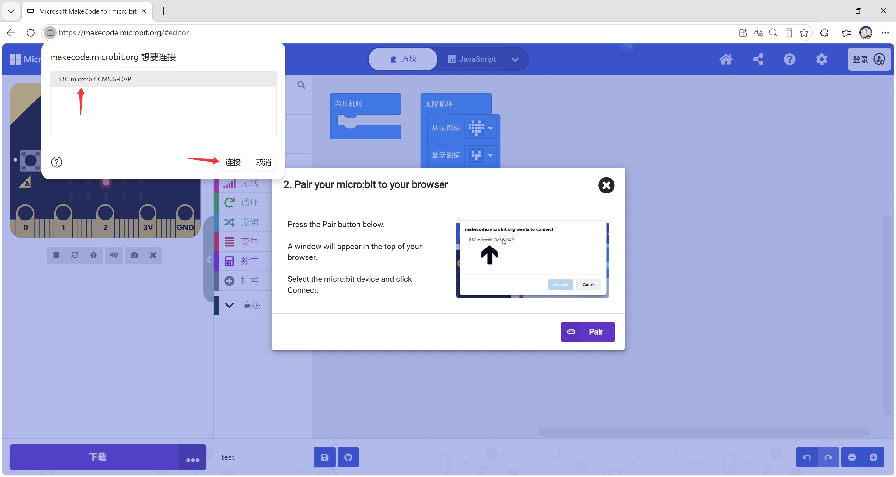
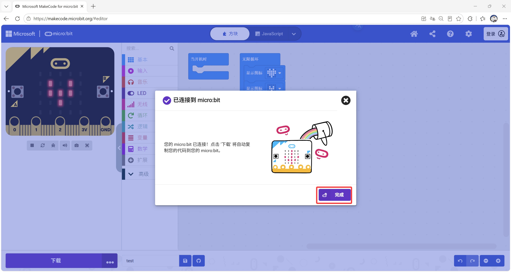
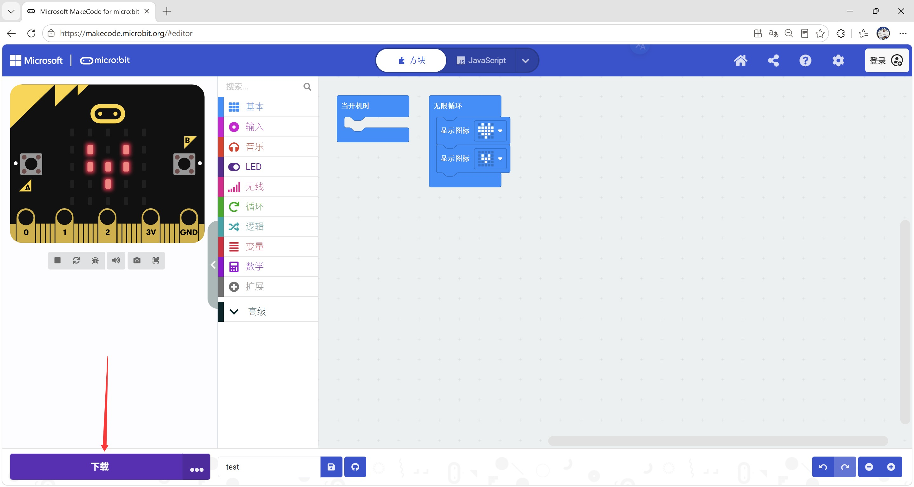
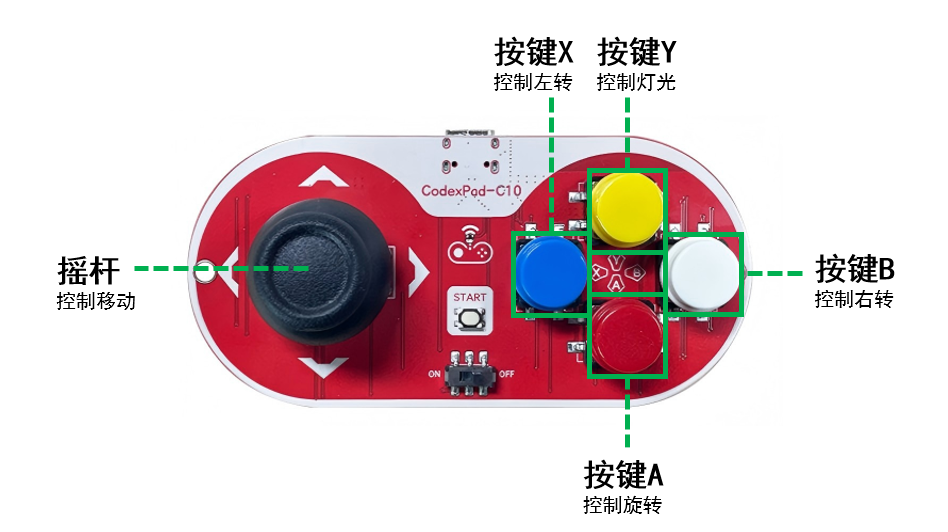

# Motor:Bit产品介绍

## 导入扩展板Makecode软件包

使用该扩展板时，需要先导入扩展板Makecode软件包。
软件包链接：https://github.com/emakefun/pxt-motorbit
具体操作请查看下方的[导入软件包](#导入软件包)

## 产品特色

Motor:Bit是[易创空间](<https://www.emakefun.com/>) 专门针对Micro:Bit而开发的驱动电机，舵机，步进电机的一款多功能电机驱动扩展板。Micro:Bit V2.0解决了市面上同类驱动板支持单节3.7V电池驱动力严重不够问题。本驱动板采用控制电路电源和舵机电源分开，单独供电方案，使用大电 流输出的电源芯片对舵机独立供电，支持DC(6~15V)电压输入，驱动芯片采用4颗大电流驱动芯片，最大驱动电流达4A，轻松同时驱动4个24V直流马达或者30暴力高速马达。舵机也可以通过外部电源独立供电，同时可以支持8个舵机同时控制。板子采用可选择直插和卧插两种方式，直插可以兼容掌控板。安装孔兼容乐高，可以非常方便安装在自己创意设计中。完善的库支持，配套开发有MakeCode、Scratch3.0、MicroPython库和教程。

| 特点 | Motor:Bit V1.0|Motor:Bit V2.0|
| ---- | -- | -- |
| 板载4个RGB   | √ | √ |
| 兼容乐高孔    | √ | √ |
| 板载4个RGB   | √ | √ |
| I2C接口      | √ （两个PH2.0接口） | √（一个PH2.0接口） |
| RGB超声波接口 | √ | √ |
| 4路电机      | √ （最大输出电流1.2A）| √（最大输出电流4A） |
| 8路舵机      | √ | √ |
| 2路4线步进电机      | √ | √ |
| 板载电池盒    | √ | × |
| 板载充电电路    | √ | × |
| 板载电池盒    | √ | × |
| IO口多种电压选择 | × | √  |
| PCB板厚度   | 1.6mm           | 1.6mm           |
| M4定位孔直径 | 4.6mm，兼容乐高   | 4.6mm，兼容乐高 |
| 产品的尺寸   | 80mm×56mm×12mm  | 80mm×57mm×12mm  |
| 净重        | 37.2g          | 37.2g           |
| 供电电压     | 3.7~4.2V        | 6~15V           |
| DC头直径    | 无 | 3.5mm           |

## 产品实物图

### Motor:Bit V1.0


### Motor:Bit V2.0


## 库说明

## 硬件接口介绍

### 正面

#### Motor:Bit V1.0


#### Motor:Bit V2.0


# 扩展板各单元模块详解

## 电源供电口


- Motor:Bit V1.0 有两个供电接口，一个PH2.0接口( + 表示接电源正极线：— 表示接电源负极线)，一个14500电池盒( + 表示电池正极：— 表示电池负极)。两个接口的输入电压为3.7V~4.2V
- Motor:Bit V1.0 按下电源开关时，电源指示灯亮蓝色，如果不亮说明电池没电了，得及时充电；该扩展板自带充电功能，只需要USB线链接USB充电口，电池放在电池座上，即可为电池充电，USB电源为5V/1A时，充电最佳；充电时，充电指示灯亮绿色，并且闪烁，充满时，充电指示灯绿色常亮；当电池反接时，电池反接指示灯长亮红色。
- Motor:Bit V2.0 有两个供电接口，一个接线柱类型( + 表示接电源正极线：— 表示接电源负极线)，一个DC头类型。在使用接线柱供电时，注意电源正负极的连接方向，扩展板接线柱的 + 符号所代表的接线口表示应该连接电源正极线、— 符号所代表的接线口表示应该连接电源负极线
- Motor:Bit V2.0:拨动开关向右拨动到OFF(EXT)时，motor:bit 扩展板是通过接线柱供电的，此时，DC头供电接口无效：拨动开关向左拨动到ON(DC)时，motor:bit 扩展板是通过DC头接口供电，此时若VSS接线帽接在5V上，接线柱供电接口无效，若VSS接线帽接在 + 上，那么VSS的供电是通过接在接线柱的电源直接供电，从而实现一块板、两个供电源
- Motor:Bit V2.0扩展板包含3V3，5V电源引脚，此外，还设计有一个VIN引脚；VIN引脚通过开关与供电源直接连接，VIN引脚于开关选择的供电源连接

> 注：Motor:Bit扩展板的红色引脚，皆为正极供电引出脚：黑色引脚皆为接地GND引脚

## RGB炫彩灯


- Motor:Bit V1.0/V2.0板载4个RGB全彩灯，连接在Micro:Bit主板的P16引脚，可以通过对P16引脚编程控制四个RGB灯亮灭和颜色。

### 板载RGB实验例程


> RGB流水灯实验设计 ，实验结果为：板载RGB灯红绿蓝三色间隔1s显示。  
> [点我跳转RGB实验源码](https://makecode.microbit.org/_XD8L8u8s77cD)

## 直流电机接口


### 控制直流电机例程实验


>实物接线图(DC供电口供电，开关拨动到on(DC))：


> 实验结果：当Micro:Bit主板的按下A键、接在M1(A01A02)的电机顺时针旋转，按下B键，电机反方向旋转。
> [点我跳转直流电机实验源码](https://makecode.microbit.org/_6pTH0XCLjYdb)

## 8路舵机接口


- Motor:Bit V1.0/V2.0  舵机引脚的蓝色插口代表输出pwm信号的引脚、连接三线舵机的PWM输入信号线，红色插口代表电源正极、连接三线舵机的电源正极线，黑色插口代表电源GND极、连接三线舵机的电源负极线
- Motor:Bit V2.0驱动舵机时，可以通过跳线帽选择不同的供电方式。如果大舵机(例如：MG996等)的数量超过4个时，蓝色接线柱必须接外部电源为舵机供电（外部供电电压和电流需要根据舵机型号需要提供），且DC头也需要接电源为扩展板供电，拨动开关拨向ON端。

> 实物连接图如下：


#### 舵机控制实验例程


> 实物连接图（例程实验选择S1引脚，实物连接也接在S1引脚）：


> 控制舵机转动到角度160，延时500ms，以速度3再转动到角度30，延时500ms，如此循环。
> [点我跳转舵机实验源码](https://makecode.microbit.org/_Ea1cH3JwmehY)

## 步进电机接口


- 包含2路5线步进电机、可以同时连接控制两个步进电机。接线从左到右依次为蓝色线、粉色线、黄色线、橙色线、红色线。

#### 步进电机实验例程


> 实物连接图（例程实验选择STPM1_2引脚，实物连接也接在相应的引脚，注意不同引脚接线的颜色）：


> 步进电机驱动实验，实验结果为：接在STPM1_2引脚的步进电机转动50°，停止延时500ms，再转动，如此循环。
> [点我跳转步进电机实验源码](https://makecode.microbit.org/_41a2Trhpfe55)

## RGB超声波


- RGB超声波的IO引脚接在引脚的P2接口，RGB口与RGB灯口对应：RGB超声波的RGB灯是扩展板灯的延伸，都是通过P16引脚控制，控制原理与控制扩展板RGB灯相同，RGB超声波内含有六个RGB灯，左右探头各三个。

#### 超声波RGB使用例程实验


> 实物连接图（RGB超声波的引脚选择P2）：


> 当超声波检测到前方距离小于10cm时，超声波的RGB灯全部会显示靛蓝，并且有闪烁的特效 
> [点我跳转RGB超声波实验源码](https://makecode.microbit.org/_TUqXfUJ2c19c)

## 8Pin_IO口引出


- Motor:Bit V1.0/V2.0 有8个引出的IO口，黑色引脚表示电源负极、红色引脚表示电源正极，蓝色表示IO信号口
- Motor:Bit V1.0的红色引脚电压为3.3V
- Motor:Bit V2.0的红色引脚电压通过IO电压选择跳线帽选择，跳线帽插在5V与VCC上时红色引脚电压为5V,跳线帽插在3V3与VCC上时红色引脚电压为3.3V。

## I2C接口


- 不同的I2C模块需要的电压不同，可以通过IO电压选择跳线帽对I2C红色引脚的电压进行调整

> I2C使用例程（控制LCD1602显示）：

 

> 实验实物图：
> 注：在接线时，需要注意LCD1602液晶的SDA引脚接在扩展板的SDA引脚、SCL引脚接在扩展板的SCL引脚、GND引脚接在扩展板的黑色GND引脚、VCC引脚接在扩展板的红色5V引脚，不同的I2C模块需要的电压不同，LCD1602液晶需要5V(注意调节液晶背面的旋钮、以调整显示效果达到最好的显示)


> 实验现象为：LCD1602液晶第一行显示`Hello! emakefun!`，第二行显示`2020 2 2`
> [点我跳转LCD1602液晶实验源码](https://makecode.microbit.org/_6s8UXUHCo67w)

## 电压引脚


- Motor:Bit 扩展板设计有三种电压引脚，分别为3V3、5V、VIN(+，没有经过降压的电压接口）
- 对于8个IO口、可以通过IO口跳线帽进行选择不同的电压：对于8个PWM舵机接口，可以通过跳线帽选择不同的电压，需要注意，当选择5V的时候，供电来源于开关选择的电源直接相关，选择‘ +’   的时候，供电来源为接线柱电源，与开关选择无关

## 导入软件包

### 打开编程网页

- [点击makecode](https://makecode.microbit.org/)  进入编程官网

### 新建项目

- 点击黑色箭头指向的`新建项目` ，进入到编程界面


### 添加包

- 点击`高级`—>`扩展`—>**输入网址**`https://github.com/emakefun/pxt-motorbit`点击搜索—>点击motorbit包


## 程序下载

## 方式一：

### 点击下载按钮

- 点击`下载`,     红色箭头所指的按扭

### 保存到Microbit的U盘上，在保存过程中micro:bit指示灯会闪烁

- 选择`MICROBIT`，点击确定 (使用的是QQ浏览器进行在线的下载)


- 点击下载（只要把microbit程序文件下载或保存到microbit主板的名为`MICROBIT`的内存盘，程序就会在microbit中运行）


### 方式二：（部分浏览器支持）

- 点击`...`，再点击`Connect Device` 



- 依据提示连接microbit到电脑并点击下一步




- 选择图中指示设备并点击连接



- 提示`已连接到micro:bit`后，点击下载可以直接一键下载到microbit，无需每次重新连接。




## MicroPython示例程序

### micro:bit MicroPython示例程序

<a href="zh-cn/microbit/motorbit/motorbit_microbit_micropython_library.zip" download>点击下载motorbit micro:bit MicroPython库</a>

### ESP32 MicroPython示例程序

<a href="zh-cn/microbit/motorbit/moborbit_esp32_micropython_library.zip" download>点击下载moborbit ESP32 MicroPython库</a>

- 直流电机控制：

> dcmotor_run(index, speed)    # index: 1/2/3/4（电机序号）, speed: -255~255 (电机速度)
> dcmotor_stop(index)   # 停止直流电机 index: 1/2/3/4 (电机序号)

```python
#1号电机以150的速度正转 2号电机以200的速度反转
import motor
picture = motor.init()
picture.dcmotor_run(1, 150)   # 支流电机M1 正向转动速度150
picture.dcmotor_run(2, -200)   # 支流电机M1 反向向转动速度200
sleep(2000)
picture.dcmotor_stop(1)
picture.dcmotor_stop(2)
```

- 步进电机运动：

> stepper(index, degree)  # index: 1/2 (步进电机序号) , degree: -360~360 (转动角度)

```python
# 控制1号步进电机转动150度
import motor
picture = motor.init()
picture.stepper(1, 150)
```

- PWM舵机控制：

> servo(index, degree, speed=10) inedx: 1/2/3/4/5/6/7/8 (舵机序号，分别对应s1/s2/s3/s4/s5/s6/s7/s8) , degree: 0~180 (角度方位) , speed: 1~10（舵机转动速度, 可以不输入）

```python
# 控制连接在S1引脚的舵机转动到90°位置
import motor
picture = motor.init()
picture.servo(1, 90)
```

```python
#控制连接在S1引脚的舵机以 5 速度转动到90°位置
import motor
picture = motor.init()
picture.servo(1, 90, speed=5)
```

### 经典案例

[CodexPad_C10手柄](/zh-cn/peripheral/codexpad/codexpad_c10/codexpad_c10.md)无线控制[麦轮小车](https://makecode.microbit.org/_36KWAzWdC45e)
> 麦轮小车程序说明：
> 控制：摇杆控制前后左右移动，Y控制车灯，按住X时向左转向（摇杆控制速度），按住B时向右转向（摇杆控制速度），按住A时小车原地旋转（摇杆控制方向和速度）



# FAQ

1. 电机/风扇/水泵不动需要怎么解决？

答：1. 确认程序和实物的引脚是不是保持一致，确保程序上传成功;
    2. 是否有外接6-15V电源，可用万用表测量电源的电压，是否有电；如果没有万用表可以用家用6-15V的DC电源，比如路由器、机顶盒等满足要求的电源;
    3. 开关是否打到ON档，Micro:Bit主板是否插反了;
    4. 电路外围是否有短路的情况，扩展板电源灯是否正常亮；扩展板是否存在烧焦味道，确认扩展板没有被烧坏。

2. 该驱动板的供电方式是怎样的?

答： Motor:Bit V1.0第一种供电方式为14500锂电池供电，第二种供电方式为PH2.0接口供电，两种供电方式的供电电压范围为3.7V-4.2V。MotorMotor:Bit V1.0第一种供电方式为3.5mm接线柱供电,第二种供电方式为3.5mmDC头供电,两种供电方式的供电电压范围为6V-15V。具体详情请看电源供电口

- [电源供电口](#电源供电口)

3. RGB超声波，RGB如何驱动？

答：RGB超声波的RGB灯珠是串联板载RGB灯珠，且是通过P16驱动。

4. Motor:Bit V2.0舵机不转动？

答：请先确定舵机供电电压，在检查 Motor:Bit V2.0扩展舵机电压选择是否正确，详情请查看

- [8路舵机接口](#8路舵机接口)
