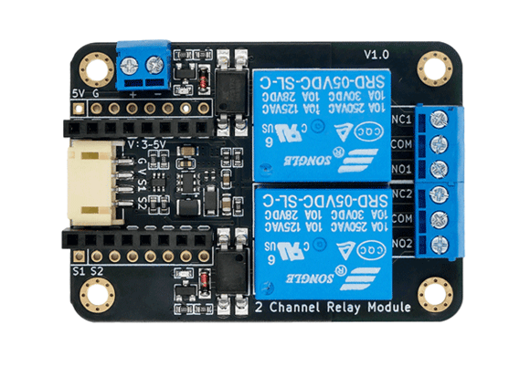
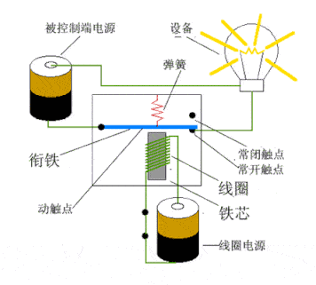
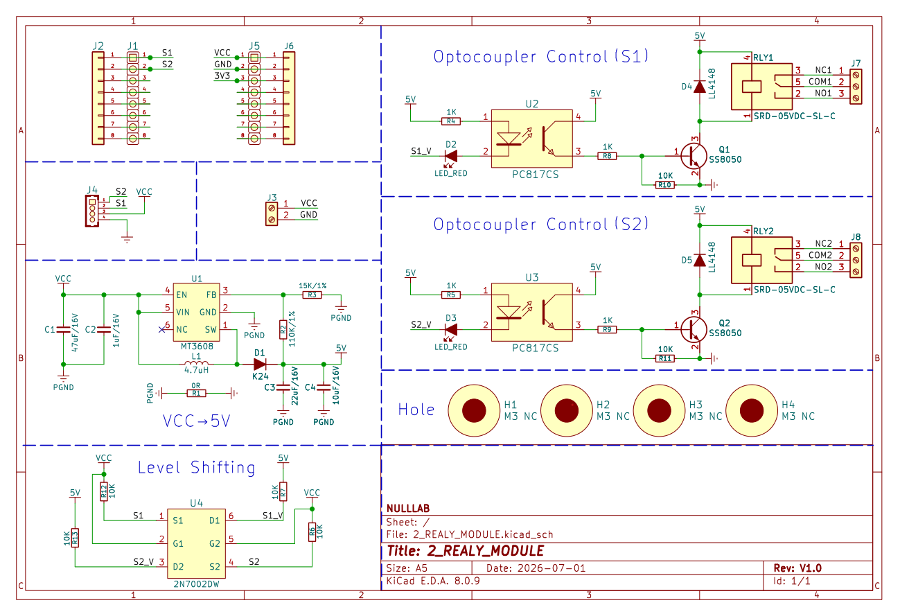
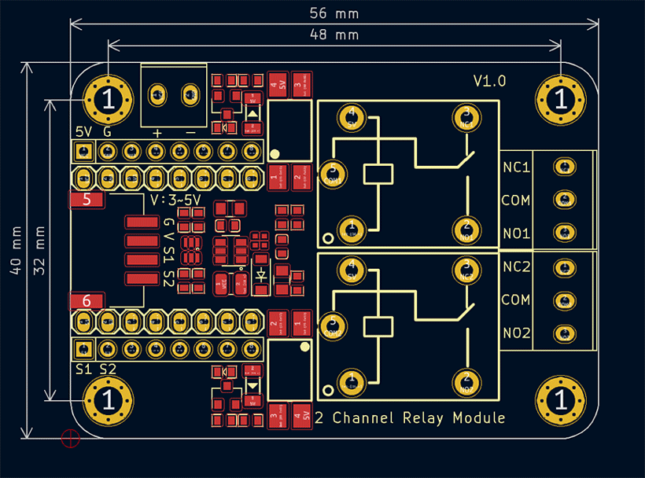
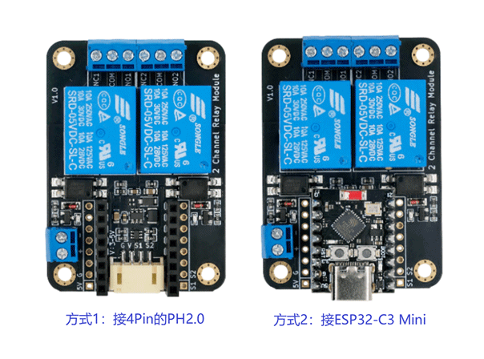

# 2路继电器模块



## 概述

继电器（Relay）是一种电控制开关，其工作原理基于电磁感应。继电器通常包括一个电磁线圈和一组触点。它具有控制系统(又称输入回路)和被控制系统(又称输出回路)之间的互动关系。通常应用于自动化的控制电路中，用小电流去控制大电流运作的一种“自动开关”，在电路中起着自动调节、安全保护、转换电路等作用。特别适合于单片机控制强电装置。<br>
1、当PH2.0接口引脚S1(S2)输入高电平或者悬空时，继电器断开，即右侧NC1(NC2)引脚和COM1(COM2)连通，对应红色灯熄灭。<br>
2、当PH2.0接口引脚S1(S2)输入低电平时，继电器吸合，右侧NO1(NO2)引脚和COM1(COM2)连通，对应红色灯亮起，同时听到嘀嗒音。

## 工作原理 ##



**电磁线圈**： 继电器内部包含一个电磁线圈，通常由绕制在绝缘芯片上的细导线组成。当通过线圈通电时，产生电磁场。<br>
**磁性吸引**： 电磁场会使继电器中的铁芯（或磁性材料）受到磁性吸引，导致铁芯在电磁力的作用下移动。<br>
**触点操作**： 铁芯移动导致机械移动，使触点开关发生动作。继电器通常有常开(Normally Open，NO)和常闭(Normally Closed，NC)两组触点。<br>
**常闭触点**： 在继电器未通电时处于闭合状态，当电磁线圈通电时，触点打开。<br>
**常开触点**： 在继电器未通电时处于打开状态，当电磁线圈通电时，触点闭合。<br>
**电气隔离**： 继电器有提供电气隔离的功能。通过电磁原理，可在控制信号与被控制电路间提供隔离，使不同电路之间的电流不会相互影响。

<a href="zh-cn/ph2.0_sensors/actuators/2_relay_module/SRD-05VDC-SL-C_datesheet.pdf" target="_blank">点击查看继电器规格书</a>

## 原理图



<a href="zh-cn/ph2.0_sensors/actuators/2_relay_module/2_relay_module_sch.pdf" target="_blank">点击查看原理图</a>

## 模块参数

* 供电电压：1.PH2.0供电(3 ~ 5V)；2.DC供电(5V)；3.TypeC供电(搭配ESP32-C3 Mini)
* 连接方式(供选择)：1.PH2.0 4pin接口；2.搭配ESP32-C3 Mini.
* 模块尺寸：56*40mm
* 触发方式：低电平触发
* 工作温度：-25℃ ~ +70℃
* 电器参数：
  * 交流：‌250VAC / 10A
  * 直流：‌30VDC / 10A
  * 线圈电阻：约 ‌70Ω(±10%)
  * ‌线圈功率‌：约360mW
  * 动作时间：≤10ms
  * 释放时间‌：≤10ms
* 安装方式：兼容C款乐高积木外壳

## 机械尺寸



<a href="zh-cn/ph2.0_sensors/actuators/2_relay_module/2_relay_module_3d.zip" download>下载继电器模块3D文件</a>

## 使用方式



| 引脚名称 |       描述       |
| :------: | :--------------: |
|    G     |    地线：GND     |
|    V     | 电源输入：3 ~ 5V |
|    S1    | 继电器S1控制引脚 |
|    S2    | 继电器S2控制引脚 |

1、可直接利用PH2.0外接主控进行控制，也可搭配ESP32-C3 Mini进行控制，用户可自行选择。<br>
2、搭配ESP32-C3 Mini时，供电方式可选择TypeC或DC座供电，同时注意对应控制引脚S1(GPIO5)、S2(GPIO6)。<br>
3、PH2.0接口的左右两侧8Pin排母与旁边未焊接8Pin排针孔对应，这些预留的排针IO口，在需要时可自行焊接。

## 示例程序

```c++
int REALY_PIN_S1 = 5; // 定义继电器S1的控制引脚为5
int REALY_PIN_S2 = 6; // 定义继电器S2的控制引脚为6

void setup() {
    pinMode(REALY_PIN_S1, OUTPUT);  // 设置S1控制引脚为输出模式
    pinMode(REALY_PIN_S2, OUTPUT);  // 设置S2控制引脚为输出模式
}

void loop() {
    digitalWrite(REALY_PIN_S1, LOW); // 设置S1输出（低电平）
    delay(500);       // 延时500ms
    digitalWrite(REALY_PIN_S2, LOW); // 设置S2输出（低电平）
    delay(500);       // 延时500ms
    digitalWrite(REALY_PIN_S1, HIGH); // 设置S1输出（高电平）
    delay(500);       // 延时500ms
    digitalWrite(REALY_PIN_S2, HIGH); // 设置S2输出（高电平）
    delay(500);       // 延时500ms
}
```

* 现象： 左右红色指示灯间隔500ms交替变化，同时继电器伴有滴答音。