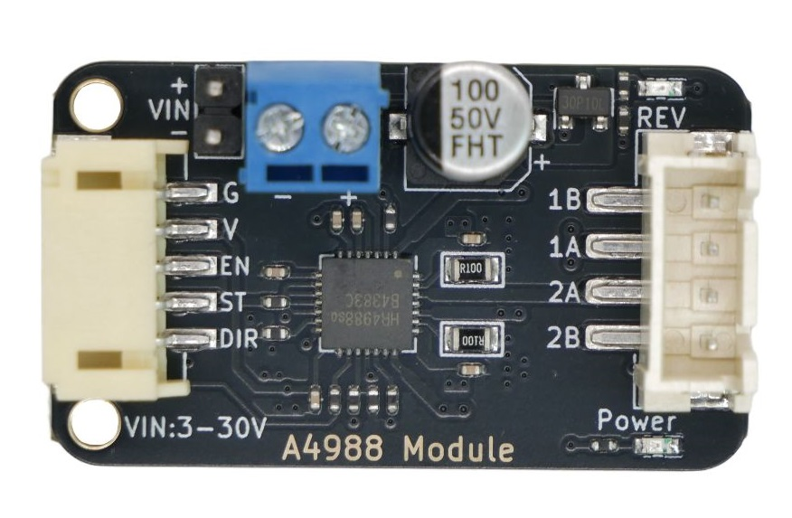
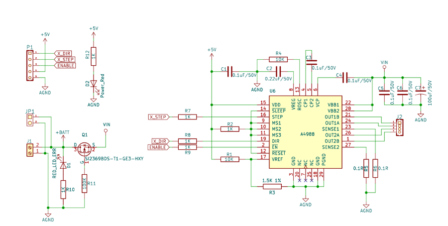
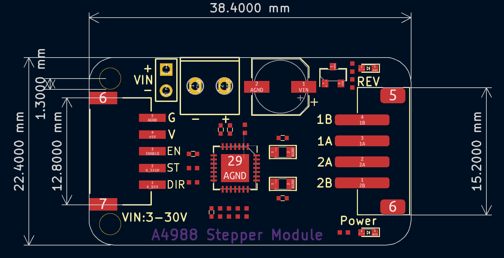
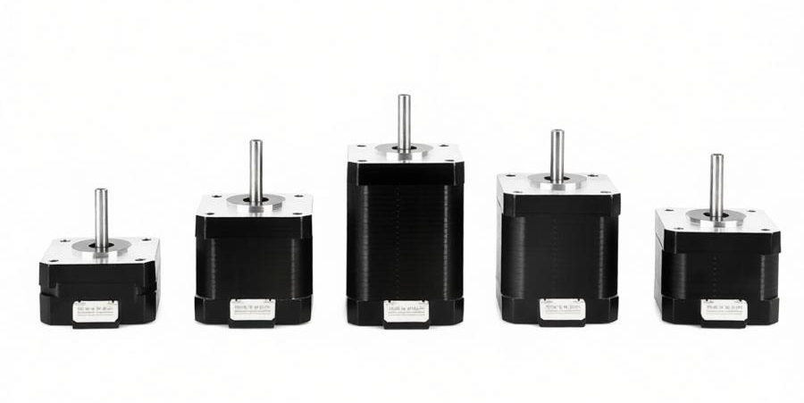
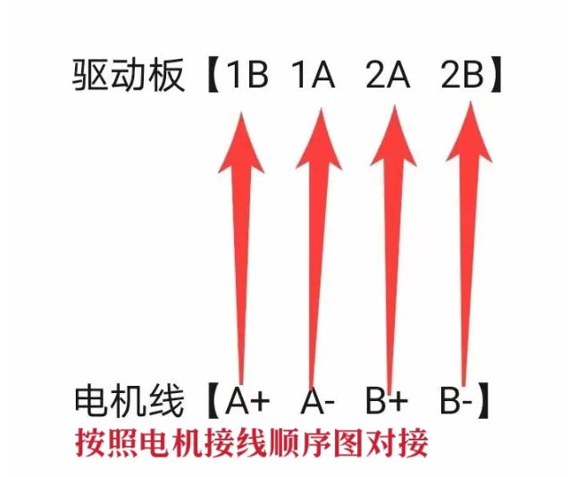
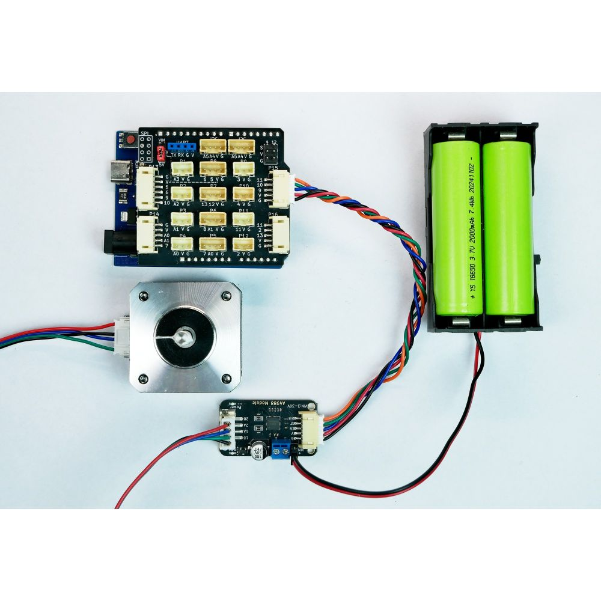
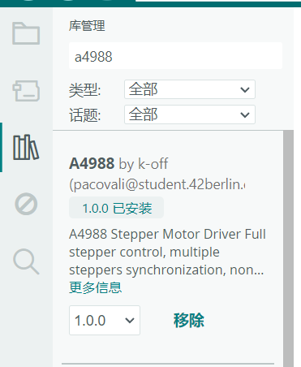

# A4988步进电机驱动模块



## 概述

A4988/HR4988是一款带内置逻辑转换器和过流保护的DMOS微步驱动器，可实现全、半及多种微步模式控制双极步进电机，输出驱动性能可达 35 V 及 ±2A，A4988/HR4988包括一个固定关断时间电流稳压器，该稳压器可在慢或混合衰减模式下工作。转换器是 A4988 易于实施的关键。只要在"步进"输入中输入一个脉冲，即可驱动电动机产生微步。无须进行相位顺序表、高频率控制行或复杂的界面编程。A4988/HR4988具备过热关闭、欠压锁定、交叉电流保护、接地短路保护和加载短路保护功能，HR4988是一款功能完全兼容替代A4988的国产步进电机驱动芯片。

**核心特性**
- 输出驱动电压：3 ~ 30V
- 输出驱动电流：固定约 0.8A（由板载 Vref 电路设定）
- 微步模式：全步、半步、1/4步、1/8步、1/16步（本模块固定为1/16步）
- 内置过流保护和过热保护
- 逻辑电压：5V

## 原理图



<a href="zh-cn/ph2.0_sensors/actuators/A4988/HR4988_datasheet.pdf" target="_blank">点击此处查看步进电机驱动芯片规格书</a>

## 模块参数

- **逻辑电压：** 5V
- **连接方式：** 输入端PH2.0-5pin接口，电机接口端xh2.54_4pin接口
- **供电电压：** 3-30V
- **模块尺寸：** 38.4×22.4mm
- **固定输出电流：** 约 0.8A（由板载 Vref 电路设定，无需调节）
- **微步分辨率：** 固定1/16步（MS1、MS2、MS3 内部已接高电平）

## 机械尺寸



<a href="zh-cn/ph2.0_sensors/actuators/A4988/A4988_3d.zip" download>点击下载3d文件</a>

## 42步进电机介绍

42步进电机（常见如 42BYGH 系列）属于两相混合式步进电机，是工业自动化及创客领域最常用的机型之一。其名称中的"42"指安装法兰边长为 42mm，符合 NEMA 17 国际标准。42步进电机的四根引出线分别属于两个独立的线圈（即两相），标记为 A+、A-、B+、B-。其中 A+ 与 A- 为同一相（A相），B+ 与 B- 为同一相（B相）。42 两相步进电机多为 1.8°/ 整步。

### 相位识别步骤

工具：数字万用表（电阻档或蜂鸣器档）

- 将万用表调至电阻档（200Ω 量程）或蜂鸣档。
- 任意测量两根线之间的电阻：
  - 如果阻值很小（通常几欧姆），说明这两根线属于**同一相线圈**。
  - 如果阻值无穷大（不导通），说明它们属于不同相。
- 重复测量，直到找出两组相互导通的线对。每组即为一个线圈（如线圈1和线圈2）。



### 电机接线顺序图



### 引脚说明

**VIN：** 电机动力电源输入。电压越高，电机高速性能通常越好，但需在电机和A4988的耐压范围内。建议使用一个独立于MCU的电源供电。

**V：** 逻辑电源。给A4988内部逻辑电路供电。

**G：** 电源地。必须将电机电源地、逻辑电源地和A4988的GND连接在一起，形成一个共同的参考地。

**ST：** 脉冲输入，每个上升沿（或下降沿，可配置）驱动电机移动一个微步。脉冲频率决定电机转速。

**DIR：** 方向控制，高/低电平决定电机转向。注意转向定义是相对的，如果反了，只需在软件中取反逻辑，或者交换电机A相的两根线即可。

**EN：** 低电平使能。

**1A、1B：** 连接至步进电机A相绕组的两端。

**2A、2B：** 连接至步进电机B相绕组的两端。

**MS1，MS2，MS3：** 微步细分驱动控制，通过这三个引脚的逻辑电平，调整A4988驱动电机模式为全、半、1/4、1/8 及 1/16 步进模式。本模块内部MS1、MS2、MS3都已接高电平，所以微步分辨率是1/16步，因此电机走完一圈需要3200个脉冲。

| MS1 | MS2 | MS3 | 微步分辨率 | 含义（42 电机 1.8° 整步）         |
| --- | --- | --- | ----- | ------------------------- |
| L   | L   | L   | 全步    | 1 脉冲走完 1个整步，200个脉冲走完一圈    |
| H   | L   | L   | 半步    | 2 脉冲走完1 个整步，400个脉冲走完一圈    |
| L   | H   | L   | 1/4步  | 4 脉冲走完 1 个整步，800个脉冲走完一圈   |
| H   | H   | L   | 1/8步  | 8 脉冲走完 1 个整步，1600个脉冲走完一圈  |
| H   | H   | H   | 1/16步 | 16 脉冲走完 1 个整步，3200个脉冲走完一圈 |

### 引脚连接图

| 电源 | A4988模块 | Arduino UNO引脚 |
| -------- | ------- | ------------ |
|          | G       | GND          |
|          | V       | 5V           |
|          | EN      | 9            |
|          | ST      | 10           |
|          | DIR     | 11           |
| 电池正极  | VIN     |              |
| 电池负极  | GND     |              |



## A4988驱动42步进电机Arduino示例程序

### 使用A4988库

```cpp
#include "A4988.h"

A4988 motor(9, 11, 10);//EN  -> 9、DIR -> 11、STEP-> 10

const uint16_t STEPS_PER_REV = 3200; // 200步 × 16微步
const float SPEED = 0.8;             // 0.001 ~ 1.0

bool dir = Forth;

void setup() {
  motor.enable();     // 使能驱动
}

void loop() {
  // 添加任务：转一圈
 if (motor.addTask(STEPS_PER_REV, dir, SPEED) == Success) {
    // 非阻塞执行每一步
    while (motor.halfStep() != TaskWasNotSet) {
      // 空循环，让 halfStep 自己计时
    }
    // 切换方向
    dir = (dir == Forth) ? Back : Forth;
  }

}
```

#### A4988库文件下载

点击左侧第三个图标，搜索**[A4988库](https://github.com/k-off/A4988)**，下载如图第一个库。



### 不使用A4988库，用引脚直接驱动

```cpp
#define STEP 10
#define DIR  11
#define EN   9

void setup() {
  pinMode(STEP, OUTPUT);
  pinMode(DIR, OUTPUT);
  pinMode(EN, OUTPUT);

  digitalWrite(EN, LOW);  // 使能驱动
}
void loop() {
  digitalWrite(DIR, HIGH); // 高电平正转
  for(int i=0; i<3200; i++){  // 16细分 一圈
    digitalWrite(STEP,HIGH);
    delayMicroseconds(800);
    digitalWrite(STEP,LOW);
    delayMicroseconds(800);
  }
  delay(1000);
  digitalWrite(DIR, LOW);  // 低电平反转
  for(int i=0; i<3200; i++){
    digitalWrite(STEP,HIGH);//产生上升沿
    delayMicroseconds(800);//控制脉冲频率，数值越大转速越慢
    digitalWrite(STEP,LOW);
    delayMicroseconds(800);
  }
  delay(1000);
}
```

## 使用注意事项

### 散热

A4988 在大电流（>0.5A）或长时间运行时会产生热量，建议：

- 在 A4988 芯片背面散热焊盘加装散热片
- 保持良好通风，避免密闭空间
- 如果模块过热触发保护，降低电机电流或增加散热措施

### 电源

- **共地：** 必须将电机电源地（VIN的GND）、逻辑电源地（V的GND）和 A4988 的 GND 连接在一起，形成共同参考地
- **独立供电：** 电机电源（VIN）建议使用独立电源，不要与 MCU 共用同一电源，避免电机启动时的电流冲击影响 MCU

### 电机连接

- **不要热插拔：** 在 A4988 上电时，不要插拔电机连接线，可能损坏驱动芯片
- **接线顺序：** 严格按照电机接线顺序图连接 A+/A-/B+/B-，接错会导致电机不转或振动
- **电机选择：** 使用双极步进电机（4线或6线），不支持单极步进电机（5线或6线中心抽头）

### 信号线

- **脉冲信号：** STEP 引脚的脉冲上升沿触发步进，脉冲宽度建议 >1μs
- **方向信号：** DIR 引脚在 STEP 脉冲上升沿之前至少保持 1μs 稳定
- **使能信号：** EN 引脚低电平使能，高电平禁止输出

## 故障排除

### 电机不转

**问题：** 给 STEP 引脚发脉冲，电机没有反应。

**解决方案：**

1. 检查 EN 引脚：必须为低电平（GND）才能使能
2. 检查电源：确认 VIN（电机电源）和 V（逻辑电源）都已供电
3. 检查接线：确认电机 A+/A-/B+/B- 接线正确，没有接错相
4. 检查共地：电机电源地、逻辑电源地、A4988 GND 必须连接在一起
5. 运行示例程序：使用 Arduino 示例验证硬件是否正常

### 电机振动但不转

**问题：** 电机发出嗡嗡声或振动，但不转动。

**解决方案：**

1. 检查接线顺序：A+/A- 和 B+/B- 可能接反了，交换其中一相的两根线
2. 降低转速：脉冲频率太高可能导致丢步，降低 delayMicroseconds 的值（增大延迟）
3. 检查电流：如果电机电流不足，可能无法驱动负载，检查电机额定电流是否匹配

### 模块过热

**问题：** A4988 芯片温度很高，烫手。

**解决方案：**

1. 加装散热片：在芯片背面散热焊盘贴散热片
2. 降低电流：如果电机额定电流较小，可以降低 Vref（需要修改 R3 电阻值）
3. 改善通风：确保模块周围有足够空气流通
4. 检查负载：电机负载过大可能导致电流持续较高

### 丢步（步进不准确）

**问题：** 电机实际转动角度与预期不符，出现丢步。

**解决方案：**

1. 降低转速：脉冲频率过高会导致丢步，降低 STEP 脉冲频率
2. 增加加速/减速：启动和停止时加入加减速过程，避免突然启动/停止
3. 检查电源：电源电压不足或纹波过大可能导致丢步，增加去耦电容
4. 检查机械负载：负载过大或机械卡滞会导致丢步

### 电机转向反了

**问题：** 电机转向与预期相反。

**解决方案：**

1. 软件调整：在代码中将DIR引脚逻辑取反
2. 硬件调整：交换电机A相的两根线（A+ 和 A-），或交换B相（B+ 和 B-）的两根线
