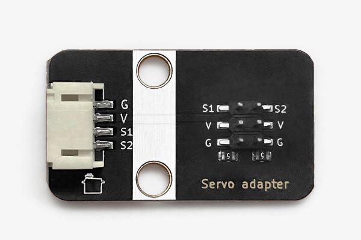
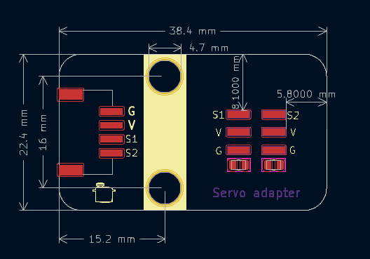

# 舵机扩展

舵机扩展板，功能是将一个4P-PH2.0接口转接成2个2.54mm间距杜邦线舵机接口的，舵机板子上自带2个500mA的保险丝，可以防止舵机堵转，卡死。

## 模块参数

* 供电电压：和舵机工作电压匹配
* 连接方式：4Pin-PH2.0防反接
* 模块尺寸：38.4*22.4mm
* 安装方式：M4螺钉兼容乐高插孔

## 机械尺寸

<a href="zh-cn/ph2.0_sensors/actuators/servo_adapter/servo_adapter_3d.zip" target="_blank">点击下载2D和3D文件</a>