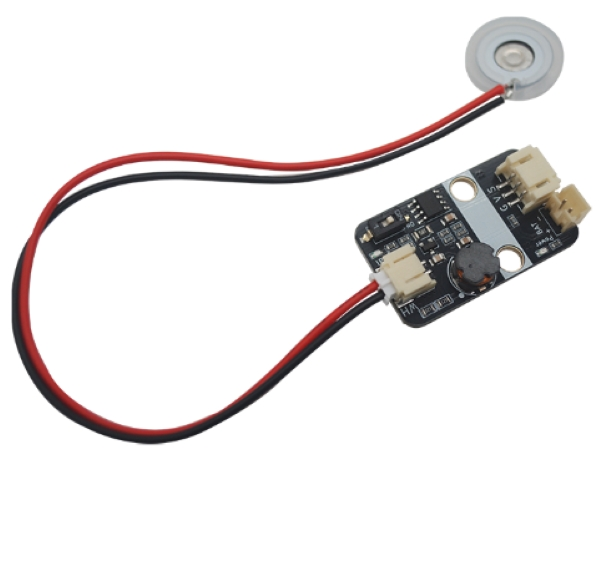
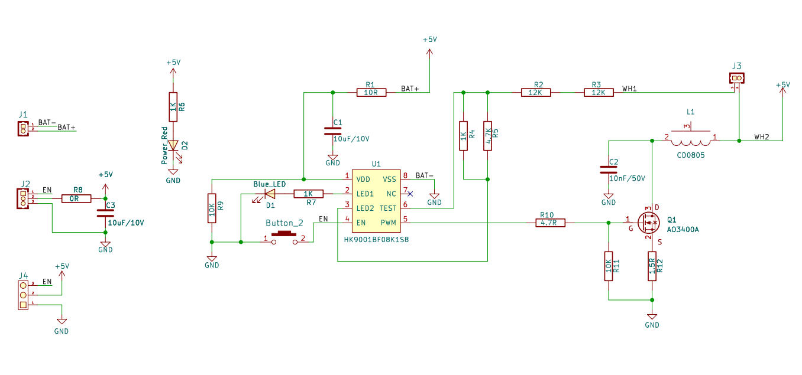
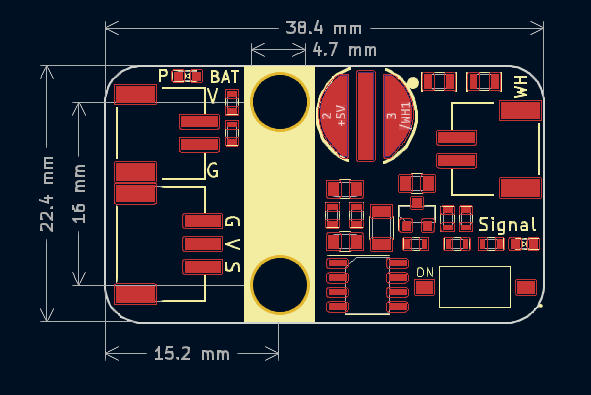

# 5V小型雾化器模块

## 概述

Atomizer模块是一款超声波雾化器模块，其利用高频振动将液体分解成细小颗粒。板载两颗高亮LED，红色LED用以指示LED供电是否正常，蓝色LED则指示雾化模块是否在工作。 
Atomizer模块可通过单片机I/O口控制，低电平触发雾化器工作蓝色LED灯亮起，低电平关闭雾化器。也可通过板上自带的拨码开关直接控制，即便在没有单片机的情况下也能轻松使用雾化器模块，使用非常便利。除此之外，雾化器适应频率范围为100KHz~160KHz（中心频率108KHz或 150KHz）微孔雾化片，其内部集成微孔雾化片频率适应电路，可以检测微孔雾化片需要频率进行驱动，自适应频率快。 
此小模块可以非常方便应用在创客小作品，PBL项目甚至医疗、美容、工业和家庭等多个领域等。

### 原理图

<a href="zh-cn/ph2.0_sensors/actuators/small_atomizer/small_atomizer_sch.pdf" target="_blank">点击下载原理图</a>

### 芯片规格书

<a href="zh-cn/ph2.0_sensors/actuators/small_atomizer/HK9001_datasheet.pdf" target="_blank">点击下载HK9001规格书</a>

## 模块参数

- 工作电压：3 ~ 5V
- 工作电流：120mA
- 震动频率频率：108KHZ
- 接 口：3pin-PH2.0接口的是供电及控制接口，2pin为雾化片接口及电池供电接口。
- 工作稳定温度范围：0℃ ~ +70℃
- 通信方式:  I/O口直接控制，高电平触发
- 尺 寸：22.4*38.4mm，兼容乐高积木和M4螺丝固定孔

## 引脚定义

| 引脚名称 | 描述        |
| -------- | :---------- |
| G        | GND     |
| V        | 3 ~ 5V |
| S      | 雾化启动控制，**低电平有效** |
| WH     | 雾化片接口 |
| + | 电池供电正极（3~5V） |
| - | 电池供电负极 |

### 机械尺寸

<a href="zh-cn/ph2.0_sensors/actuators/small_atomizer/small_atomizer_3d.zip" download>下载小型雾化器模块平面和3D文件</a>