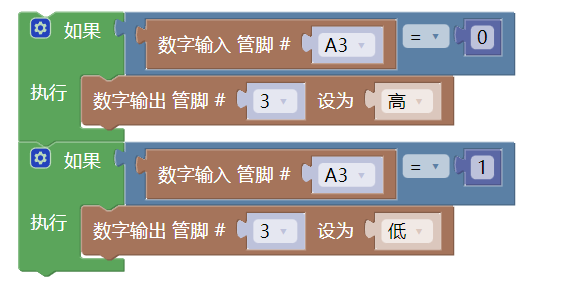

# 按键模块


## 概述

​按键也称之为轻触开关，使用时以满足操作力的条件向开关操作方向施压，开关闭合接通；当撤销压力时开关即断开，其内部结构是靠金属弹片受力变化来实现通断的。如下图，正常情况下按键的1和2、3和4 脚是相连的；当我们按下按键时，四个脚相互连通；松开按键时， 释放后弹片依靠自身复原力，恢复成断开状态。


​上面只是展示其中一种按键的形态，为了使用根据使用场景，轻触按键有很多种结构形态，但是它们的工作原理都一样。

## 原理图


​模块正常连接上后，模块的红色电源power灯亮起，当按键按下时，模块输出低电平，蓝色Signal信号灯亮起；由于本模块上拉了一个4.7K电阻，所以松开后输出高电平，同时蓝色Signal信号灯熄灭。

## 尺寸图


<a href="zh-cn/ph2.0_sensors/base_input_module/button_module/button_module3d.zip" download>下载按键模块3D文件</a>

## 模块参数

- 供电电压：3~5V
- 连接方式：PH2.0-3PIN防反接线
- 模块尺寸：38.4x22.4mm
- 安装方式：M4螺钉兼容乐高插孔固定

| 引脚名称 | 描述                      |
| :----- | :----------------------- |
| G    | GND                     |
| V    | 3~5V 电源输入               |
| S    | 信号数字输出，不按时为高电平，按下时输出低电平 |

## Arduino Uno使用示例

### 接线

按键模块接P1（A3引脚），LED模块接P9（3引脚）；

**接线端口可自行更改，只需注意编程时选择对应引脚，本教程时按照示例程序接口连接。**


### Arduino示例程序

<a href="zh-cn/ph2.0_sensors/base_input_module/button_module/button_module.zip" download>下载示例程序</a>

```cpp
constexpr uint8_t kLedOut = 3;
constexpr uint8_t kKeypadPin = A3;
int8_t g_button_value = 0;

void setup() {
  pinMode(kLedOut, OUTPUT);
  pinMode(kKeypadPin, INPUT);
}

void loop() {
  g_button_value = digitalRead(kKeypadPin);
  if (g_button_value == LOW) {
    digitalWrite(kLedOut, HIGH);
  } else {
    digitalWrite(kLedOut, LOW);
  }
}
```

#### Mixly示例程序



<a href="zh-cn/ph2.0_sensors/base_input_module/button_module/button_mixly_demo.zip" download>下载示例程序</a>

### micro:bit示例程序

<a href="https://makecode.microbit.org/_bHkRLAeXDeMo" target="_blank">动手试一试</a>

### ESP32-MicroPython示例程序

按钮模块通过3Pin线接在主板P1口（esp32  IO5）；

LED模块通过3Pin线接在主板P2口（esp32  IO2）；

**接线端口可自行更改，只需注意编程时调节端口，本教程全按照示例接口进行。**


<a href="zh-cn/ph2.0_sensors/base_input_module/button_module/esp32_micropython.zip" download>示例程序下载</a>

```python
from machine import Pin
button = Pin(5, Pin.IN)  # 按键引脚
led = Pin(2, Pin.OUT)    # LED引脚
while True:
    if button.value() == 0:
       led.value(1)  
    else:
       led.value(0)
```

## 实验结果

器件连接好线之后，将上述程序烧录到主板之后，给主板通电，按下按键将使得LED点亮，松开则灯灭。通过按键的按下与松开，触发按键的信号口输出高低电平,通过判断信号口的高低电平状态，控制LED灯的亮与灭的状态。
