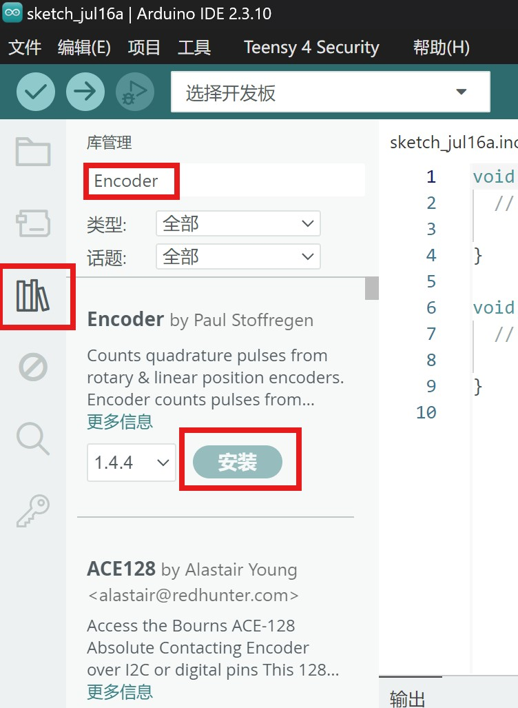
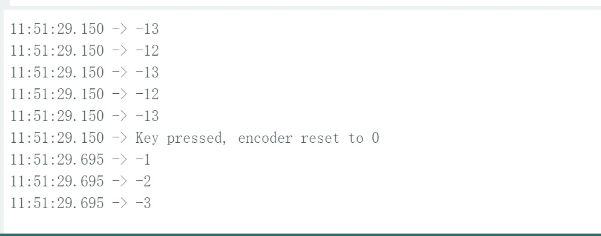

# 旋转编码器

编码器是一种将旋转位移转换为一连串数字脉冲信号的旋转式传感器，旋转编码器可通过旋转可以计数正方向和反方向转动过程中输出脉冲的次数，旋转计数不像电位计，这种转动计数是没有限制的。配合旋转编码器上的按键，可以实现某些特定功能。读数系统通常采用差分方式，即将两个波形一样但相位差为180°的不同信号进行比较，以便提高输出信号的质量和稳定性。编码器广泛用于汽车音量、空调调节等应用场景。

## 原理图

## 模块参数

- 供电电压：3~5V
- 连接方式：PH2.0 5pin
- 模块尺寸：38.4x22.4mm
- 安装方式：M4螺钉兼容乐高插孔

| 引脚名称 | 描述                           |
| :------- | :----------------------------- |
| G        | GND                            |
| V        | 3~5V                           |
| A        | A端口输出引脚，对应A相输出     |
| B        | B端口输出引脚，对应B相输出     |
| D        | D端口输出引脚,对应带的按键输出 |

## 尺寸图

<a href="zh-cn/ph2.0_sensors/base_input_module/rotary_encoder_module/rotary_encoder_module_3d.zip" download>下载旋转编码器模块3D文件</a>

## 旋转编码器工作原理

编码器内部有一个开槽圆盘，连接到公共接地引脚 C。它还具有两个接触针 A 和 B，如下所示。

当您转动旋钮时，A 和 B 按照特定顺序与公共接地引脚 C 接触，具体顺序取决于转动旋钮的方向。

当它们与公共地接触时，会产生两个信号。这些信号存在 90° 异相，因为一个引脚先于另一个引脚接触公共地。它被称为**正交编码**。

当顺时针旋转旋钮时，A 引脚先于 B 引脚接地。当逆时针旋转旋钮时，B 引脚先于 A 引脚接地。

通过监控每个引脚何时连接或断开接地，我们可以确定旋钮旋转的方向。这可以通过简单地观察 A 的状态改变时 B 的状态来完成。

当A改变状态时：

1.如果 B != A，则顺时针转动旋钮。

2.如果 B = A，则逆时针转动旋钮。

## Arduino示例程序

硬件接线如下表格所示

| Arduino | 旋转编码器 |
| :------ | :--------- |
| VCC     | V          |
| GND     | G          |
| IO 5    | A          |
| IO 6    | B          |
| IO 7    | D          |

<a href="zh-cn/ph2.0_sensors/base_input_module/rotary_encoder_module/rotary_encoder_PressKey.zip" download>点击此处下载案例程序</a>

打开Arduino IDE，下载所需要的库，**Encoder**。

打开案例程序，烧录完成后，打开串口助手，设置波特率为9600，点击“打开串口”按钮，等待程序运行。

串口显示旋转的次数。按下按键显示Key pressed, encoder reset to 0,并且计数值清0.

顺时针转1级则加1，逆时针转1级则减1。一圈为15级。

## Mixly示例程序

<a href="zh-cn/ph2.0_sensors/base_input_module/rotary_encoder_module/rotary_encoder_mixly_demo.zip" download>下载示例程序</a>

## ESP32 MicroPython示例程序

<a href="zh-cn/ph2.0_sensors/base_input_module/rotary_encoder_module/ec11_esp32_micropython.zip" download>点击此处下载ESP32 MicroPython示例程序</a>

## micro:bit示例程序

### micro:bit Python 示例程序

<a href="zh-cn/ph2.0_sensors/base_input_module/rotary_encoder_module/ec11_microbit_micropython.zip" download>点击此处下载micro:bit Python示例程序</a>

### micro:bit MakeCode 示例程序

<a href="https://makecode.microbit.org/_Aspg3ah3sXL0" target="_blank">动手试一试</a>

将旋转编码器A引脚接Microbit P1引脚，B引脚接P2引脚，D引脚接P8引脚，通过往一个方向旋转旋转编码器时，Microbit显示屏显示1，当按下按钮往一个方向旋转Microbit显示屏显示2；往逆方向旋转Microbit显示屏显示-1，按下按钮往逆方向旋转Microbit显示屏显示-2，按下松开不旋转Microbit显示屏显示3
