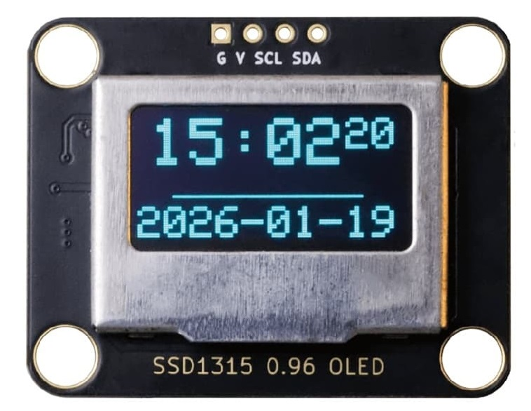
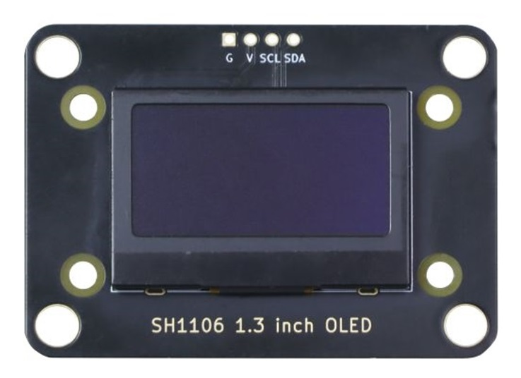
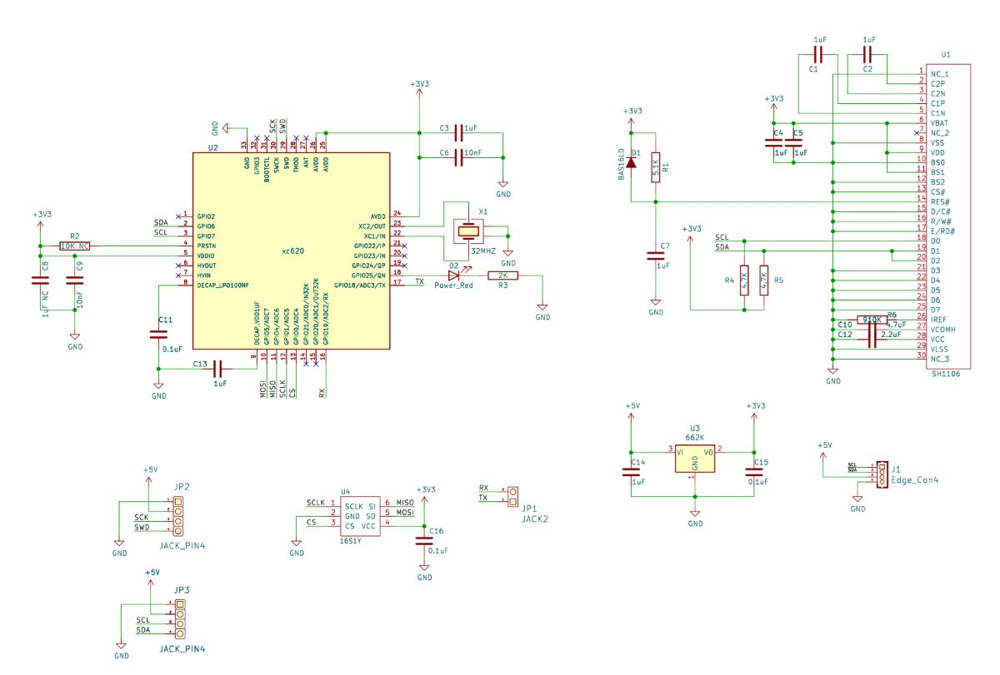
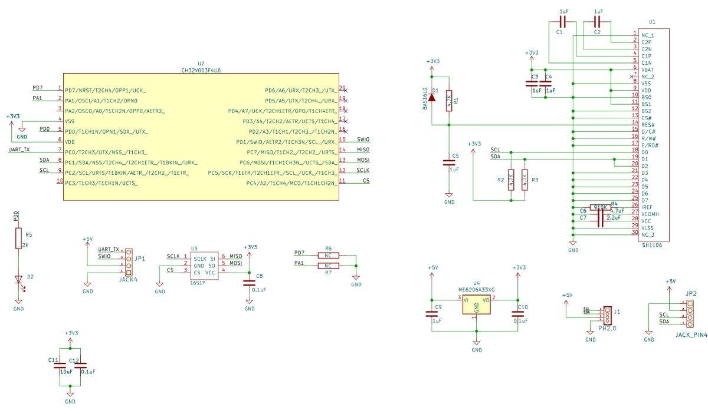
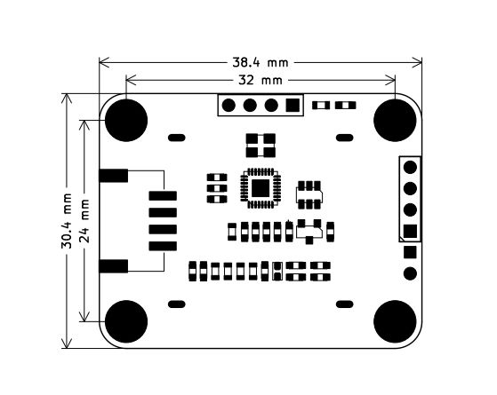
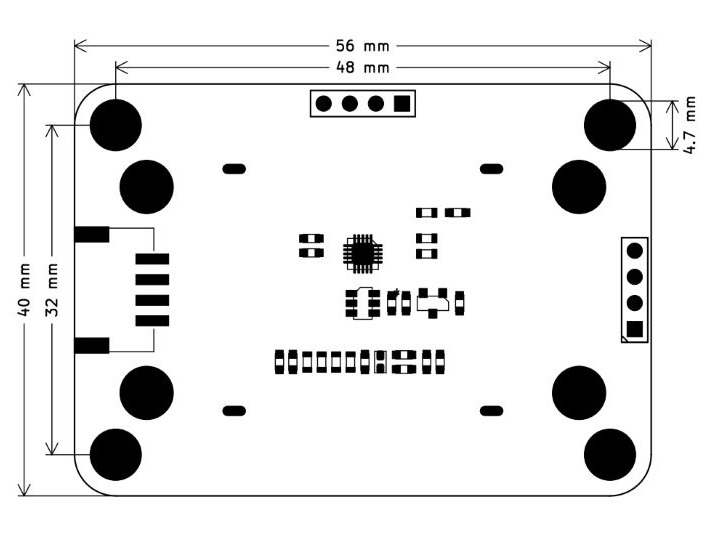

# 带中文字库OLED模块

## 0.96寸OLED实物图



## 1.3寸OLED实物图



## 概述

0.96寸oled和1.3寸oled使用显示驱动芯片为SH1106，SH1106是一款单芯片CMOSOLED/PLED驱动器，带有控制器，用于有机/聚合物发光二极管点阵图形显示系统。SH1106由132个段组成,64个公共端可支持132×64的最大显示分辨率。它专为共阴极型OLED面板而设计。SH1106嵌入了对比度控制，显示RAM振荡器和高效的DC-DC转换器，减少了外部元件的数量和功耗。<br>
0.96寸OLED我们为了解决Uno主板中文显示不方便和字库文件过大问题，在模块中增加了一个mcu芯片可以让用户通过同一个I2C接口直接读取到字库GT20L16S1Y芯片里面的字模用于中文显示。<br>
<a href="zh-cn/ph2.0_sensors/displayers/oled/SH1106_datasheet.pdf" target="_blank">点击下载SH1106数据手册</a> <br>
<a href="zh-cn/ph2.0_sensors/displayers/oled/GT20L16S1Y_datasheet.pdf" target="_blank">击下载字库芯片GT20L16S1Y数据手册</a>

## 模块参数

- 工作电压：5V
- 驱动芯片：SH1106
- 通信方式：IIC (SH1106地址0x3C，字库MCU地址0x51)
- I2C最大速率：400k
- 接口类型：PH2.0-4Pin

## 引脚定义

| 引脚名称 | 描述      |
| ---- | ------- |
| SCL  | IIC时钟引脚 |
| SDA  | IIC数据引脚 |
| V    | 5V电源引脚  |
| G    | GND 地线  |

## 原理图

### 0.96寸OLED



<a href="zh-cn/ph2.0_sensors/displayers/oled/0.96_inch_OLED_sch.pdf" target="_blank">点击此处下载0.96寸OLED原理图</a>

### 1.3寸OLED



<a href="zh-cn/ph2.0_sensors/displayers/oled/1.3_inch_OLED_sch.pdf" target="_blank">点击此处下载1.3寸OLED原理图</a>

## 模块尺寸

### 0.96寸OLED



### 1.3寸OLED



<a href="zh-cn/ph2.0_sensors/displayers/oled/oled_3d.zip" download>下载0.96和1.3英寸OLED的平面和3D文件</a>

## 接线示例

| 显示屏模块 | Arduino |
| ----- | ------- |
| SDA   | A4      |
| SCL   | A5      |
| GND   | GND     |
| VCC   | 5V      |

## Arduino示例

显示中文、英文、数字、标点字符，使用时请先安装**U8G2**库

```c++
#include "em_oled.h"

EM_OLED u8g2(U8G2_R0, U8X8_PIN_NONE);

void setup() {
  Serial.begin(115200);
  u8g2.begin();
}

void loop() {
  u8g2.firstPage();
  do {
    u8g2.ShowFont(0, 0, "EMAKEFUN易创空间www.emakefun.com");
  } while (u8g2.nextPage());
}
```

### Arduino函数介绍

```c++
/*
显示字体
输入参数：
（x,y）起始坐标，显示字符的左上角坐标 
*str：要显示的UTF8字符数据可直接写汉字和字符
*/
uint8_t ShowFont(uint8_t x, uint8_t y, uint8_t *str);
```

### Arduino示例程序

<a href="zh-cn/ph2.0_sensors/displayers/oled/chinese_font_demo.zip" download>下载最新库程序</a>

### Mixly图形化块


<a href="zh-cn/ph2.0_sensors/displayers/oled/oled_mixly.zip" download>点击下载Mixly示例程序</a>

### micro:bit MakeCode块

<a href="https://makecode.microbit.org/_1xP2br2C10zX" target="_blank">点击查看micro:bit示例程序</a>
