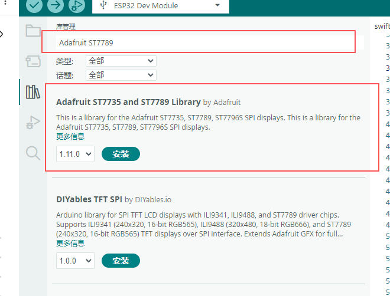
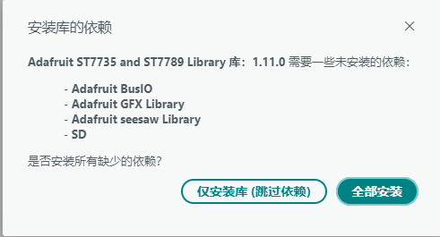
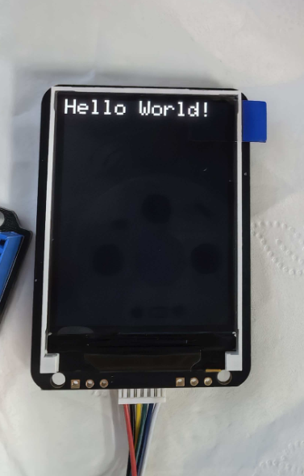

# SWIFT-LCD-20显示屏模块

## 实物图


## 概述

SWIFT-LCD-20显示屏模块是一款**2.0英寸**全彩TFT LCD显示屏模块，屏幕分辨率为**240\*320**像素。模块采用标准4线SPI通信接口和IPS硬屏技术，集成了高性能驱动芯片与背光电路，提供丰富的色彩显示和清晰的图像效果，具备色彩鲜艳、可视角度大、高对比度的特点。模块在确保高效通信的同时，通过内置电路简化了硬件连接，将**RES（复位）**与**BLK（背光控制）**引脚在模块内部上拉至高电平，显著降低了硬件连接与初始化的复杂度。适用于各类嵌入式人机交互界面、智能设备状态显示等需要丰富视觉内容的场景。

## 显示屏参数

- 屏幕尺寸：2.0英寸
- 屏幕分辨率：240*320像素
- 可视角度：全视角
- 显示颜色：全彩
- 功耗：80mA
- 背光类型：LED背光
- 驱动芯片：ST7789
- 通信接口：4线SPI
- 工作温度：-20°C ~ 70°C

## 原理图


<a href="zh-cn/ph2.0_sensors/displayers/swift_lcd_20/swift_lcd_20.pdf" target="_blank">点击此处查看原理图</a>

## 模块参数

- 工作电压：3.3V ~ 5V
- 接口：GH1.25间距接口
- 连接方式：GH1.25 转 PH2.0 6Pin 防反接连接线
- 模块尺寸：56*40mm，兼容乐高积木

| 引脚名称 | 描述 |
| :--- | :--- |
| G | GND 地线 |
| V | 3.3V ~ 5V电源引脚 |
| SCL | 串行接口时钟 |
| SDA | SPI接口输入/输出引脚 |
| DC | 数据显示/命令选择引脚 |
| CS | 片选信号引脚，低电平有效 |

**特别说明：RES（复位）和BLK（背光控制）引脚在模块内部默认拉高，不对外引出，无需外部连接。**

## 支持的硬件平台

| 支持的硬件平台 |
| :--- |
| Arduino uno |
| Arduino nano |
| ESP32 |
| ESP32-S2 |
| ESP32-S3 |
| ESP32-C3 |
| ESP32-C5 |
| ESP32-C6 |
| ESP32-H2 |
| ESP32-P4 |
| micro:bit |
| Raspberry Pi |

## 机械尺寸图


## Arduino 基础示例程序

### Arduino uno 示例

#### 接线

| 显示屏模块 | Arduino uno引脚 |
| :--- | :--- |
| CS | 10 |
| DC | 9 |
| SDA | 11 |
| SCL | 13 |
| V | 5V |
| G | GND |

> 注意：Arduino Uno 的硬件 SPI 引脚是固定的，SCK（时钟）必须接 13，MOSI（数据）必须接 11，无法通过软件修改。本示例采用硬件 SPI 模式，因此 SCL 接 13、SDA 接 11。

#### 示例程序

```c++
#include <Adafruit_ST7789.h>  // ST7789 显示屏驱动库
#include <SPI.h>              // SPI 通信库

namespace {
constexpr uint8_t kDisplayDcPin = 9;   // 数据/命令选择引脚 DC
constexpr uint8_t kDisplayCsPin = 10;  // 片选引脚 CS

constexpr uint32_t kTextSize = 3;  // 文字大小

constexpr uint16_t kScreenWidth = 240;   // 屏幕宽度（像素）
constexpr uint16_t kScreenHeight = 320;  // 屏幕高度（像素）

// 创建显示对象，参数依次为 硬件SPI指针、CS引脚、DC引脚、复位引脚(-1表示不使用)
Adafruit_ST7789 g_display(&SPI, kDisplayCsPin, kDisplayDcPin, -1);
}  // namespace

void setup() {
  SPI.begin();  // 初始化硬件 SPI（Uno 引脚 SCK=13, MOSI=11 固定）

  g_display.init(kScreenWidth, kScreenHeight);  // 初始化显示屏（宽240，高320）
  g_display.setRotation(2);                     // 旋转显示方向（2=180°）
  g_display.fillScreen(ST77XX_BLACK);           // 屏幕背景填充为黑色
  g_display.setTextSize(kTextSize);             // 设置文字大小
  g_display.setTextColor(ST77XX_WHITE);         // 设置文字颜色为白色
  g_display.print("Hello World!");              // 在屏幕上显示文字（默认位置是0,0）

void loop() {
}
```

#### 依赖库安装

1. **打开 Arduino IDE 库管理器**

   - 菜单栏：**工具** → **管理库...**
   - 快捷键：`Ctrl+Shift+I`（Windows/Linux）或 `Cmd+Shift+I`（Mac）

2. **搜索并安装**

   - 在搜索框中输入：`Adafruit ST7789`
   - 找到`Adafruit ST7735 and ST7789 Library by Adafruit` 库
   - 选择版本 `1.11.0`
   - 点击 **安装** 按钮

    

3. **安装依赖库**

   - 当出现依赖库安装对话框时，选择 **全部安装**

    

#### 示例显示效果

将示例程序烧录到主板之后，给主板通电，等待几秒后，可以看到SWIFT-LCD-20显示屏模块上会显示"Hello World!"字样，如下图



### ESP32 示例

#### 接线

| 显示屏模块 | ESP32引脚 |
| :--- | :--- |
| CS | 12 |
| DC | 14 |
| SDA | 15 |
| SCL | 17 |
| V | 5V |
| G | GND |

#### 示例程序

```c++
#include <Adafruit_ST7789.h>  // ST7789 驱动库
#include <SPI.h>              // SPI 通信库

namespace {
constexpr auto kDisplaySclkPin = GPIO_NUM_17;  // SPI时钟引脚 SCK
constexpr auto kDisplayMosiPin = GPIO_NUM_15;  // SPI数据引脚 MOSI(SDA)
constexpr auto kDisplayDcPin = GPIO_NUM_14;    // 数据/命令选择引脚 DC
constexpr auto kDisplayCsPin = GPIO_NUM_12;    // 片选引脚 CS

constexpr uint32_t kTextSize = 3;  // 文字大小

constexpr uint16_t kScreenWidth = 240;   // 屏幕宽度（像素）
constexpr uint16_t kScreenHeight = 320;  // 屏幕高度（像素）

// 创建显示对象，参数依次为 硬件SPI指针、CS引脚、DC引脚、复位引脚(-1表示不使用)
Adafruit_ST7789 g_display(&SPI, kDisplayCsPin, kDisplayDcPin, -1);
}  // namespace

void setup() {
  // 初始化SPI总线，参数依次为 SCK引脚、MISO引脚(-1未用)、MOSI引脚、SS引脚(-1未用)
  SPI.begin(kDisplaySclkPin, -1, kDisplayMosiPin, -1);

  g_display.init(kScreenWidth, kScreenHeight);  // 初始化显示屏（宽240，高320）
  g_display.setRotation(2);                     // 旋转显示方向（2=180°）
  g_display.fillScreen(ST77XX_BLACK);           // 屏幕背景填充为黑色
  g_display.setTextSize(kTextSize);             // 设置文字大小
  g_display.setTextColor(ST77XX_WHITE);         // 设置文字颜色为白色
  g_display.print("Hello World!");              // 在屏幕上显示文字（默认位置是0,0）
}

void loop() {
}
```

#### 依赖库安装

1. **打开 Arduino IDE 库管理器**

   - 菜单栏：**工具** → **管理库...**
   - 快捷键：`Ctrl+Shift+I`（Windows/Linux）或 `Cmd+Shift+I`（Mac）

2. **搜索并安装**

   - 在搜索框中输入：`Adafruit ST7789`
   - 找到`Adafruit ST7735 and ST7789 Library by Adafruit` 库
   - 选择版本 `1.11.0`
   - 点击 **安装** 按钮

    

3. **安装依赖库**

   - 当出现依赖库安装对话框时，选择 **全部安装**

    

#### 示例显示效果

将示例程序烧录到主板之后，给主板通电，等待几秒后，可以看到SWIFT-LCD-20显示屏模块上会显示"Hello World!"字样，如下图


## ESP32 Arduino LVGL库使用示例

### 接线

| 显示屏模块 | ESP32 |
| :--- | :--- |
| CS | 14 |
| DC | 15 |
| SDA | 16 |
| SCL | 17 |
| V | 5V |
| G | GND |

### 示例程序

<a href="zh-cn/ph2.0_sensors/displayers/swift_lcd_20/swift_lcd_20_esp32_lvgl_example.zip" download>示例程序下载</a>

### 依赖库安装

1. **打开 Arduino IDE 库管理器**

   - 菜单栏：**工具** → **管理库...**
   - 快捷键：`Ctrl+Shift+I`（Windows/Linux）或 `Cmd+Shift+I`（Mac）

2. **搜索并安装**

    - 安装 **lvgl** 库

        - 在搜索框中输入：`lvgl`
        - 找到`lvgl by kisvegabor` 库
        - 选择版本 `9.2.2`
        - 点击 **安装** 按钮

    - 安装 **GFX** 库

        - 在搜索框中输入：`GFX Library for Arduino`
        - 找到`GFX Library for Arduino by Moon On` 库
        - 选择版本 `1.6.3`
        - 点击 **安装** 按钮

    

### 示例显示效果

将示例程序烧录到主板之后，给主板通电，等待几秒后，可以看到SWIFT-LCD-20显示屏模块上会显示"Hello World!"字样，如下图


