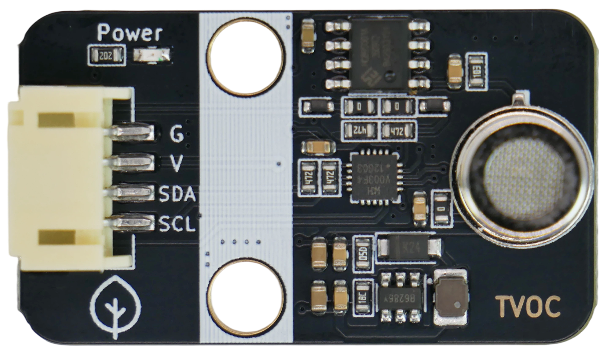
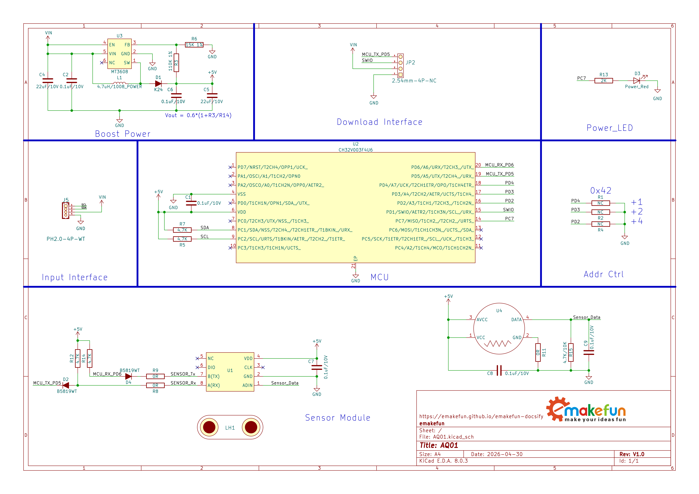
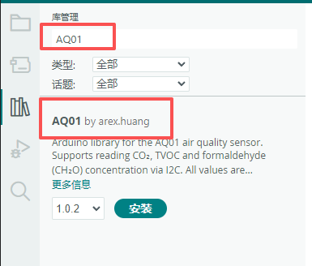
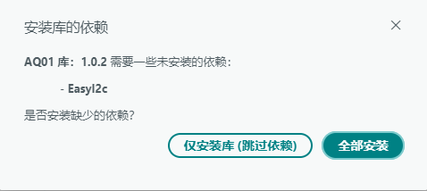

# AQ01空气质量传感器模块

## 实物图

## 概述

AQ01空气质量传感器是一款用于测量**总有机挥发物（TVOC（包含氨气、氢气、酒精、一氧化碳、二氧化碳、甲烷、甲醛等有机挥发气体，以及香烟、木材、纸张燃烧产生的烟雾和油烟等））**，并同步输出 **总有机挥发物（TVOC）**、**二氧化碳（CO₂）**、**甲醛（HCHO）** 三种浓度数据的三合一空气质量传感器模块。模块具有自动校准、三合一数据输出、高灵敏度、低功耗等特点，适用于空车载及家用空气净化器、多合一空气质量监（检）测仪等场景。

> 特别说明：二氧化碳（CO₂）和甲醛（HCHO）浓度数据是模块经过软件换算的模拟数值。

## 原理图

<a href="zh-cn/ph2.0_sensors/sensors/aq01/aq01.pdf" target="_blank">点击此处查看原理图</a>

## 气体量程范围

| 检测项目 | 量程范围 |
| :--- | :--- |
| 总有机挥发物（TVOC） | 0 ~ 2.000 mg/m³ |
| 二氧化碳（CO₂） | 350 ~ 2000 ppm |
| 甲醛（HCHO） | 0 ~ 1.000 mg/m³ |

## 模块参数

- 供电电压：5V
- 工作电流：≤ 80 mA
- 环境参数：
  - 工作温度：-10 ~ 40 ℃
  - 工作湿度：≤ 95% RH
  - 存储温度：-20 ~ 60 ℃
  - 存储湿度：≤ 60% RH
- 性能参数：
  - 响应时间：≤ 10 秒
  - 恢复时间：≤ 120 秒
  - 预热时间：120 秒
- 通信方式：I2C通信，地址0x42
- 连接方式：PH2.0-4Pin防反接杜邦线
- 模块尺寸：38.4 x 22.4 mm
- 安装方式：M4螺钉兼容乐高插孔固定

| 引脚名称 | 描述 |
| :--- | :--- |
| G | GND |
| 5V | 5V电源输入 |
| SDA | I2C数据引脚 |
| SCL | I2C时钟引脚 |

## 机械尺寸图

## 注意事项

- 初次上电使用建议预热 **5 ~ 10 分钟** 以上进行测试，待数据稳定后再采集。
- 请避免震动和跌落，以及严禁液体流入传感器内部。
- 请勿将该模块应用于涉及人身安全的系统中。
- 请勿将该模块长时间置于高浓度有机气体中，以免传感器灵敏度加速衰减。
- 请勿将模块安装在强空气对流环境下使用。

## Arduino示例程序

### 库程序安装

1. **打开 Arduino IDE 库管理器**

   - 菜单栏：**工具** → **管理库...**
   - 快捷键：`Ctrl+Shift+I`（Windows/Linux）或 `Cmd+Shift+I`（Mac）

2. **搜索并安装**

   - 在搜索框中输入：`AQ01`
   - 找到 AQ01 库
   - **确保在下拉菜单中选择最新版本**
   - 点击 **安装** 按钮

    

    > **📌 注意：** 截图仅供参考。请务必安装最新可用版本。

3. **安装依赖库**

   - 当出现依赖库安装对话框时，选择 **全部安装**

    

> **⚠️ 重要版本说明**  
> 本文档中的截图可能显示较旧版本。**请始终安装以下两者的最新版本**：
>
> - `AQ01` 库
> - `EasyI2C` 依赖库
>
> 如果您跳过了依赖库安装，请手动安装最新版 `EasyI2C`：
>
> 1. 再次打开库管理器
> 2. 搜索 `EasyI2C`
> 3. 在下拉菜单中**选择最新版本**
> 4. 点击安装

### 示例说明

- **示例位置**：在 Arduino IDE 中，通过 **文件** → **示例** → **AQ01** → **aq01** 找到该示例。

- **示例说明**：通过 I2C 读取 AQ01 传感器，每秒输出一次总有机挥发物（TVOC）、二氧化碳（CO₂）和甲醛（HCHO）的浓度值。

## MicroPython 示例程序

### ESP32 MicroPython示例程序

待补充

### micro:bit MicroPython示例程序

待补充

## micro:bit MakeCode示例程序

待补充
