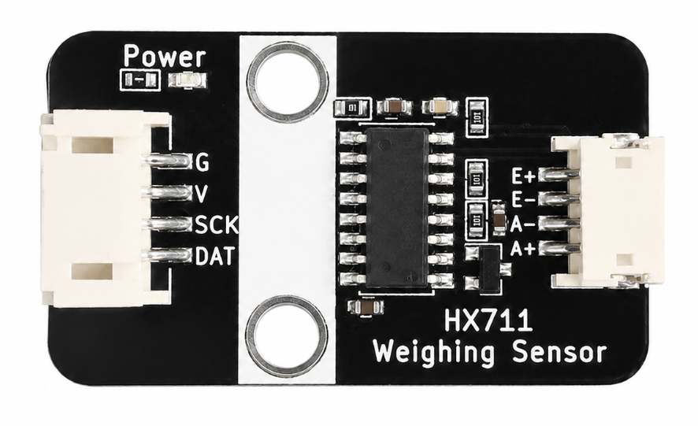
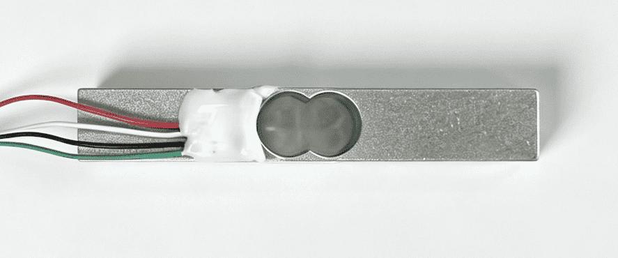
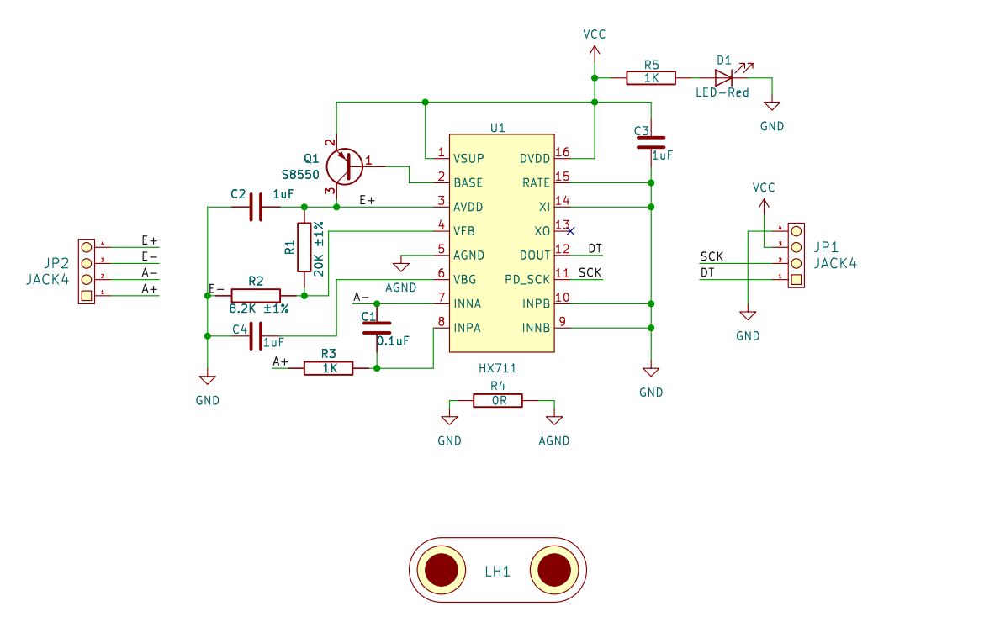
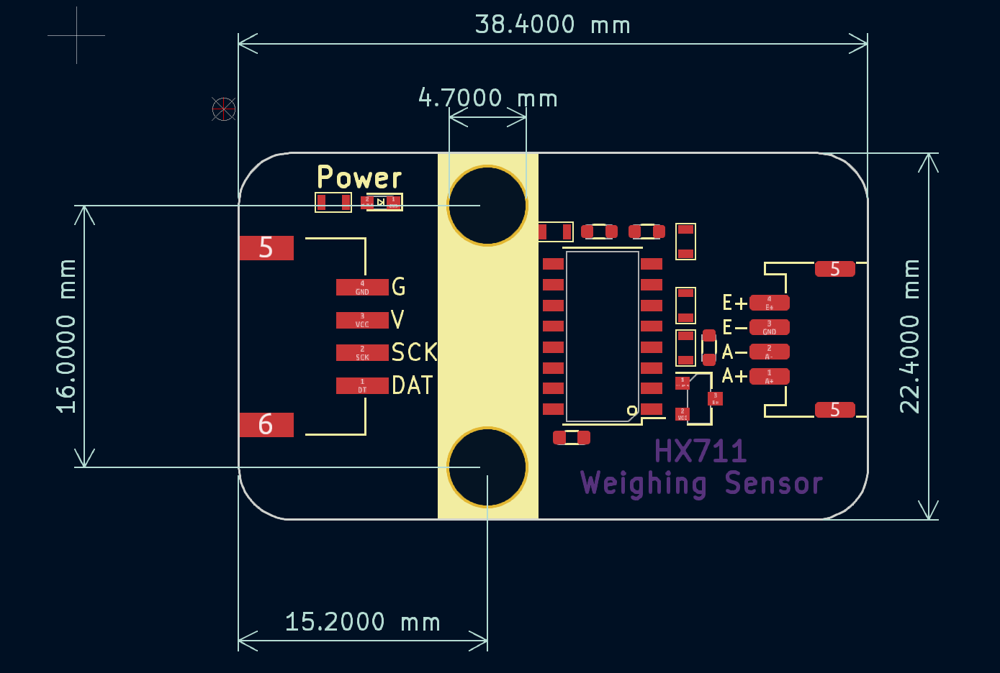

# HX711 称重模块

## 实物图



## 概述

HX711 是一款专为高精度电子秤设计的 24 位 A/D 转换芯片。该芯片内部集成了稳压电源、片内时钟振荡器等，具有集成度高、响应速度快、抗干扰性强等优点。模块采用 HX711 芯片配合压力传感器（电阻应变片），可精确测量重量，广泛应用于电子秤、工业控制、智能家具等场景。

### 称重传感器（Load Cell）



模块配套的**悬臂式称重传感器**，内部采用惠斯通电桥结构的应变片。当受力时，应变片发生微小形变，输出 mV 级差分电压信号，经 HX711 放大并转换为数字量。

| 接线端子 | 颜色 | 功能   |
| :------: | :--: | :----- |
|    E+    |  红  | 激励正 |
|    E-    |  黑  | 激励负 |
|    A+    |  白  | 信号正 |
|    A-    |  绿  | 信号负 |

## 原理图

<a href="zh-cn/ph2.0_sensors/sensors/hx711_weight_sensor/hx711_schematic.pdf" target="_blank">查看原理图</a>



## 模块参数

| 引脚名称 |     描述     |
| :------: | :----------: |
|   VCC   |    电源正    |
|   GND   |    电源地    |
|    DT    | 数据输出引脚 |
|   SCK   | 时钟输入引脚 |

- 供电电压: 5V
- 分辨率: 24 位
- 采样速率: 10/80 Hz
- 工作电压: 2.6~5.5V
- 连接方式: 4PIN 防反接杜邦线

## 机械尺寸图



## Arduino 示例程序

### 简单读取示例

<a href="zh-cn/ph2.0_sensors/sensors/hx711_weight_sensor/hx711_simple.zip" download>点击下载示例</a>

```c
/**
 * @file hx711_simple.ino
 * @brief HX711称重模块
 *
 * 硬件连接：
 *   HX711 DAT(数据) → Arduino D5
 *   HX711 CLK(时钟) → Arduino D6
 *   VCC → 5V, GND → GND
 */

#include "HX711.h"

#define DATA_PIN  5
#define CLOCK_PIN 6
#define SCALE_VALUE 1092.673828   // 校准值

HX711 scale;

void setup() {
  Serial.begin(115200);
  scale.begin(DATA_PIN, CLOCK_PIN);

  // 等待传感器就绪
  scale.wait_ready();

  // 设置中值滤波
  scale.set_median_mode();

  // 设置校准值
  scale.set_scale(SCALE_VALUE);

  // 自动去皮
  Serial.println("[系统] 初始化HX711...");
  Serial.print("[系统] Scale=");
  Serial.println(SCALE_VALUE, 6);

  scale.tare(20);
  Serial.println("[系统] 去皮完成");

  // 显示offset信息
  Serial.print("[调试] Offset=");
  Serial.println(scale.get_offset());
  Serial.println("[系统] 开始测量\n");
}

void loop() {
  // 获取重量（5次采样）
  float weight = scale.get_units(5);

  // 调试信息
  Serial.print("[测量] 原始值=");
  Serial.print(scale.get_value(5), 2);
  Serial.print(" | 重量=");
  Serial.print(weight, 2);
  Serial.println(" g");

  delay(300);
}
```

### 校准 + 测量示例

<a href="zh-cn/ph2.0_sensors/sensors/hx711_weight_sensor/hx711_calibration.zip" download>点击下载示例</a>

```c
/**
 * @file hx711_calibration.ino
 * @brief HX711校准+测量一体程序
 *
 * 硬件连接：DAT→D5, CLK→D6, VCC→5V, GND→GND
 * 流程：上电 → 去皮 → 输入已知重量校准 → 自动开始测量
 */

#include "HX711.h"

#define DATA_PIN 5
#define CLOCK_PIN 6

HX711 scale;

void setup() {
  Serial.begin(115200);
  scale.begin(DATA_PIN, CLOCK_PIN);
  scale.wait_ready();
  scale.set_median_mode();

  Serial.println("=== HX711校准 ===\n");

  // 步骤1: 去皮
  Serial.println("1. 移除所有物品，按回车去皮...");
  wait_enter();
  scale.tare(20);
  Serial.println("   去皮完成！\n");

  // 步骤2: 输入已知重量
  Serial.println("2. 放置已知重量(克)，输入数值后按回车:");
  float weight = read_float();
  Serial.print("   已知重量: ");
  Serial.print(weight);
  Serial.println(" g\n");

  // 步骤3: 校准
  Serial.println("3. 正在校准...");
  scale.calibrate_scale(weight, 30);

  Serial.print("\n校准完成！scale=");
  Serial.println(scale.get_scale(), 6);

  // 步骤4: 重新去皮，准备测量
  Serial.println("\n4. 请移除校准重量，按回车开始测量...");
  wait_enter();
  scale.tare(20);

  Serial.println("\n=== 开始测量 ===\n");
}

void loop() {
  float weight = scale.get_units(5);
  Serial.print("重量: ");
  Serial.print(weight, 2);
  Serial.println(" g");
  delay(300);
}

void wait_enter() {
  while (!Serial.available());
  Serial.readStringUntil('\n');
}

float read_float() {
  while (!Serial.available());
  float val = Serial.parseFloat();
  Serial.readStringUntil('\n');
  return val;
}
```

## 使用说明

### 首次校准

1. 烧录 `hx711_calibration.ino`，打开串口监视器（波特率 **115200**）
2. 按提示去皮 → 放上已知重量 → 输入重量值 → 获取 `scale` 校准值
3. 将校准值填入 `hx711_simple.ino` 的 `SCALE_VALUE` 宏定义

```
校准完成！scale=1092.673828   ← 记录此值
```

```c
#define SCALE_VALUE 1092.673828   // 替换为你的校准值
```

### 日常使用

1. 上电后自动去皮后，再将测量物品放入，开始测量
2. 测量时保持传感器稳定，避免震动
