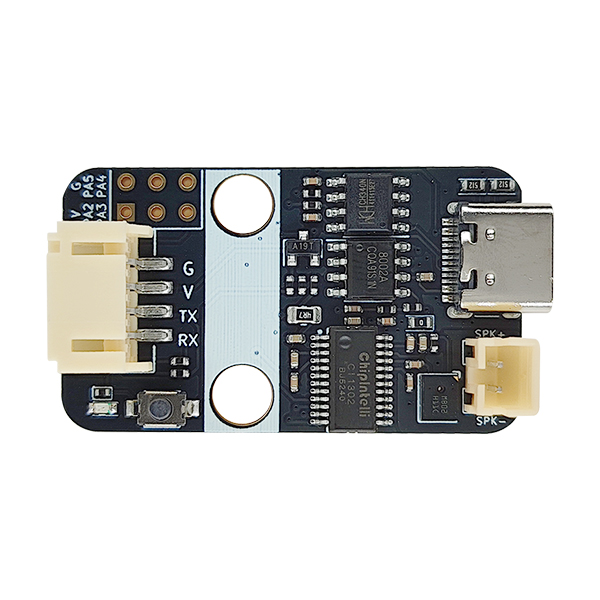

# 离线特定语音识别ASR-V2

## 模块实物图

## 概述

本语音识别模块采用了启英泰伦CI1302芯片，集成了语音识别功能，支持中文、英文等语言的语音识别。支持通过串口与单片机通信，允许客户自己开发模块固件，实现语音识别功能。操作简单，安装方便，价格便宜。

## 模块特点

1. 内置脑神经网络处理器/启英泰伦CI130X系列处理器。
2. 支持DNN/TDNN/RNN等神经网络及卷积运算硬件运算，非软件运算。
3. 支持语音识别、 语音增强、 语音检测、 播报打断(AEC打断)。
4. 360度全方位拾音支持单麦克风降噪、增强单麦 克风回声消除。
5. 支持中/英和方言定制等功能。
6. 支持双麦，支持声源定位，抗噪音能力更强。

## 原理图

待补充

## 功能说明图

待补充

## 尺寸图

待补充

## 固件烧录方法

小白玩家建议先看视频教程，理清固件烧录方法。[点击此处观看视频教程](https://document.chipintelli.com/%E8%A7%86%E9%A2%91%E6%95%99%E7%A8%8B/%E8%A7%86%E9%A2%91%E6%95%99%E7%A8%8B/)

### 快速开始

[点击此处开发固件](https://aiplatform.chipintelli.com/firmwareslave?rwId=0)

点击上述链接后，点击新建项目。

按照下图所示，填写项目信息，点击创建。

填写以下信息后，点击继续。

按照下图所示，填写配置信息后，点击继续。

按照下图所示选择自己需要的语音功能后，点击立即提交。

提交后等待编译完成，点击下载固件。

也可以使用我们的示例固件进行测试。

<a href="zh-cn/ph2.0_sensors/smart_module/asr_speech_recognition/Asr_Speech_Recognition_v1.0.0.zip" download>点击此处下载示例固件</a>

下载后解压文件，打开烧录软件。

打开软件后,选择CI1302芯片，再点击固件升级。

将语音模块通过Type-C数据线连接电脑，选择对应的COM口。

按下复位按钮，等待固件烧录完成即可。烧录完成后取消勾选相应COM口。

现在，语音模块已经烧录完成，可以进行语音识别测试。对它呼叫“智能管家”，它就会回应你啦！

## 通过Arduino获取语音识别模块数据

以示例固件为例，我们可以通过Arduino获取语音识别模块的数据。

我们需要下载相应的Arduino库(兼容ESP32)。

[点击查看Arduino库函数说明](https://emakefun-arduino-library.github.io/em_asr_speech_recognition/html/zh-CN/classem_1_1_asr_speech_recognition.html)

<a href="zh-cn/ph2.0_sensors/smart_module/asr_speech_recognition/em_asr_speech_recognition-main.zip" download>点击下载Arduino库</a>

将相应的库添加至Arduino IDE中。软件使用方法可参照[Arduino IDE使用说明](zh-cn/software/arduino_ide/arduino_ide.zh-CN.md)

### 接线图

| 语音模块接口 | esp32接口 |
| ------------ | --------- |
| RX           | D14       |
| TX           | D15       |

| 语音模块接口 | Arduino接口 |
| ------------ | --------- |
| RX           | D13       |
| TX           | D12       |

按下图所示，将喇叭模块连接至语音模块相应接口，再将语音模块的TX端接D12，RX端接D13。

### 测试

1.打开Arduino IDE，打开示例文件。

2.将程序烧录至Arduino后，打开串口，选择波特率为9600。

3.说出相应的命令，Arduino会返回相应的识别结果。

## micro:bit MakeCode示例程序

<a href="https://makecode.microbit.org/S15398-86855-41727-87467" target="_blank">点击查看micro:bit MakeCode示例程序</a>

<a href="https://github.com/emakefun-makecode-extensions/emakefun_asr_speech_recognition" target="_blank">点击查看用户库网址</a>

**注意**: 普通的命令码为0x81，欢迎语的命令码为0x82。客户根据自己设计的命令码进行相应的识别。
