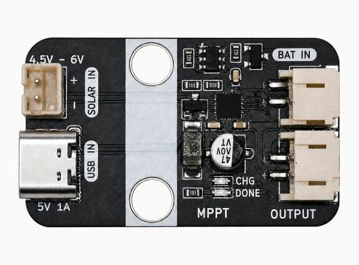
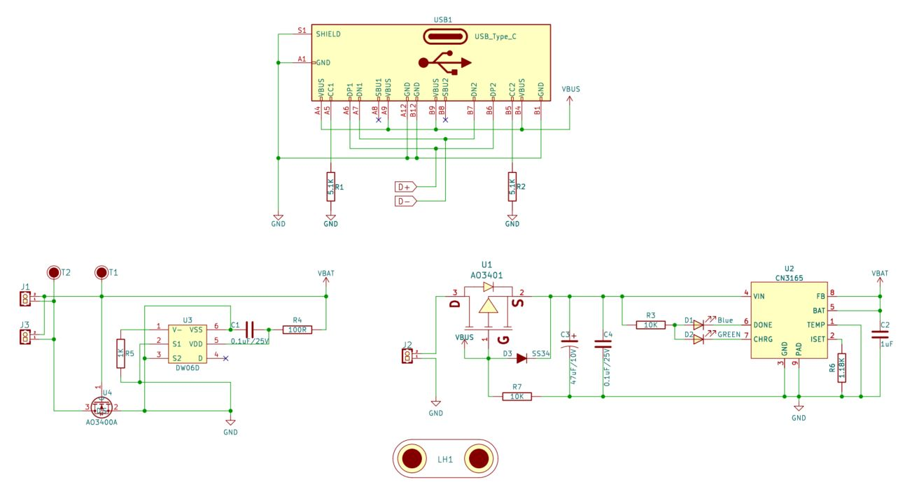
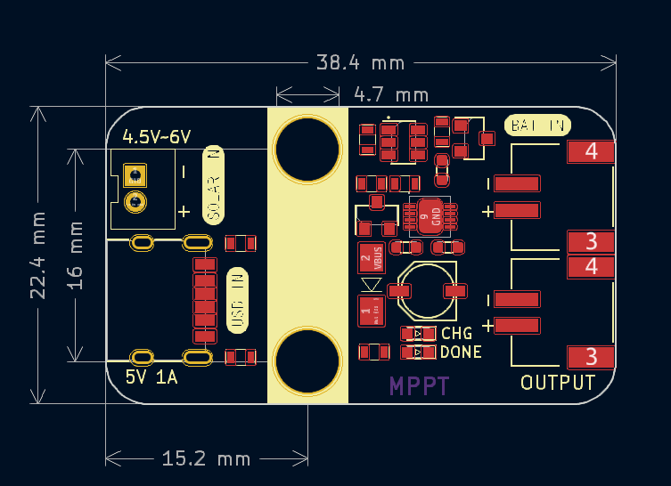

# MPPT太阳能充电模块

## 概述

MPPT模块是一款可通过太阳能发电板及USB接口给锂电池充电的模块。当太阳光照射到电池板上时，光子与半导体材料相互作用，产生电子-空穴对，从而形成电流，电流通过板上集成的管理芯片给电池充电，也可以通过PH2.0接口外接出去给其他系统使用。板载两颗高亮LED，绿色LED用以指示正在充电，蓝色LED则指示电池电量已经充满。 
MPPT模块无需外部控制，即插即用。使用非常便利。除此之外，MPPT模块集成电池管理芯片，防止电池过充或过放，能有效保护电池，延长电池使用寿命，拥有PH2.0防反插接口。 
此设备可以应用于户外活动、旅行、小型电子设备供电、和家庭等多个领域等。

### 原理图

### 芯片规格书

<a href="zh-cn/ph2.0_sensors/smart_module/MPPT/CN3165_datesheet.pdf" target="_blank">点击下载太阳能充电芯片CN3165原理图</a>

## 模块参数

- 太阳能板充电输入电压：4.5-6V
- 工作电流：180mA
- 最大功率：1.5W
- 接 口：PH2.0间距接口、USB接口，2pin-PH2.0为太阳能充电板接口及充电输出接口。
- 工作稳定温度范围：-20℃ ~ +70℃
- 尺 寸：22.4*38.4mm
- 安装方式：M4螺钉螺母固定

## 接口定义

| 接口名称 | 描述        |
| -------- | :---------- |
| USB IN | USB充电输入接口 |
| SOLAR IN | 太阳能板充电板输入接口 |
| BAT IN | 3.7V锂电池接口 |
| OUTPUT | 对外供电输出接口（范围3.7~4.2V）  |

## 机械尺寸

<a href="zh-cn/ph2.0_sensors/power_module/MPPT/MPPT_3d.zip" download>下载MPPT太阳能充电模块平面和3D文件</a>