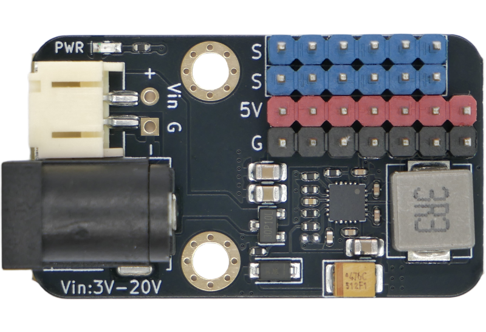
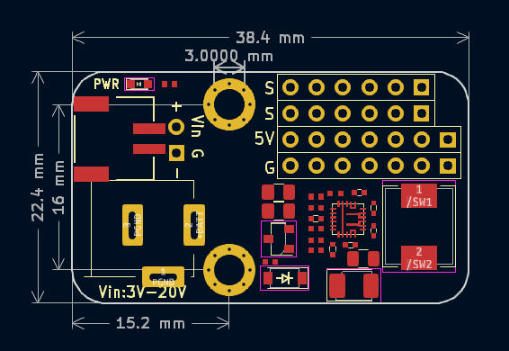

# PM02 5V5A升降压电源模块

## 概述

该电源模块是一款基于升降压DC-DC（NL2332）芯片设计最大峰值可到5V5A输出电源模块。模块支持PH2.0和DC头输入。相比PM01纯降压方案，PM02支持升降压功能输入电压范围3~20V，兼容性更强。本模块专为大电流舵机驱动扩展使用，也可以同时给其他需要使用5V电压3A以上电流场景供电。

## 模块参数

- 电源输入：PH2.0接口和5.5-2.1mm DC头输入
- 输入电压：3-20V（宽电压输入）
- 输出：最大电流5V5A，最多可以接6路舵机
- 模块尺寸：38.4×22.4 mm
- 安装方式：M3 螺丝（孔径3mm）固定

## 使用说明

- G、V、 S 三个杜邦线可以直接接3pin-2.54mm间距的舵机
- 独立S引脚为外部单片机控制信号引脚
- 注意和外部单片机控制使用的时候需要电源模块和主控电源共地连接
- 升降压特性：输入电压低于5V时自动升压，高于5V时自动降压，始终稳定输出5V

## 原理图

<a href="zh-cn/power_module/PM02/PM02_sch.pdf" target="_blank">点击下载PM02原理图</a>

## 机械尺寸图

<a href="zh-cn/power_module/PM02/PM02_3d.zip" download>点击下载3d文件</a>
